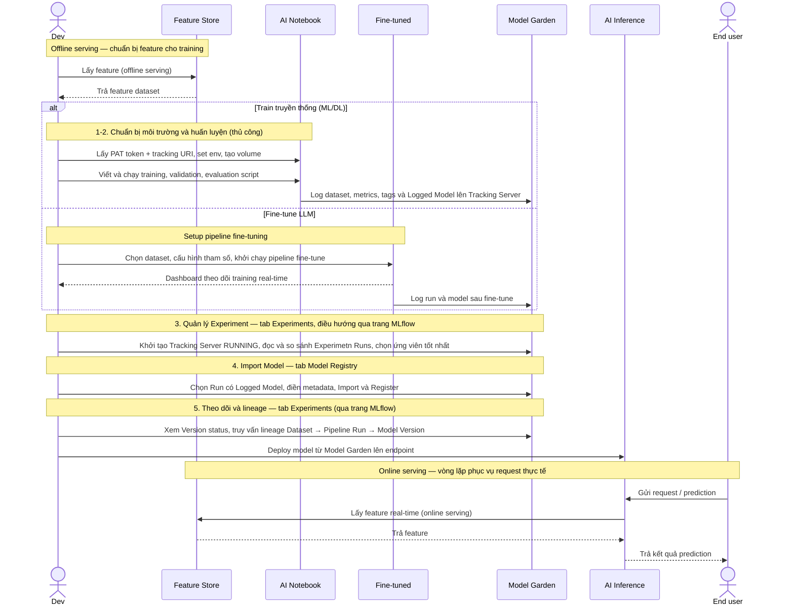

```mermaid
sequenceDiagram
    actor Dev
    participant FeatureStore as Feature Store
    participant Notebook as AI Notebook
    participant FineTuned as Fine-tuned
    participant Garden as Model Garden
    participant Inference as AI Inference
    actor EndUser as End user

    Note over Dev,FeatureStore: Offline serving — chuẩn bị feature cho training
    Dev->>FeatureStore: Lấy feature (offline serving)
    FeatureStore-->>Dev: Trả feature dataset

    alt Train truyền thống (ML/DL)
        Note over Dev,Notebook: 1-2. Chuẩn bị môi trường và huấn luyện (thủ công)
        Dev->>Notebook: Lấy PAT token + tracking URI, set env, tạo volume
        Dev->>Notebook: Viết và chạy training, validation, evaluation script
        Notebook->>Garden: Log dataset, metrics, tags và Logged Model lên Tracking Server
    else Fine-tune LLM
        Note over Dev,FineTuned: Setup pipeline fine-tuning
        Dev->>FineTuned: Chọn dataset, cấu hình tham số, khởi chạy pipeline fine-tune
        FineTuned-->>Dev: Dashboard theo dõi training real-time
        FineTuned->>Garden: Log run và model sau fine-tune
    end

    Note over Dev,Garden: 3. Quản lý Experiment — tab Experiments, điều hướng qua trang MLflow
    Dev->>Garden: Khởi tạo Tracking Server RUNNING, đọc và so sánh Experimetn Runs, chọn ứng viên tốt nhất

    Note over Dev,Garden: 4. Import Model — tab Model Registry
    Dev->>Garden: Chọn Run có Logged Model, điền metadata, Import và Register

    Note over Dev,Garden: 5. Theo dõi và lineage — tab Experiments (qua trang MLflow)
    Dev->>Garden: Xem Version status, truy vấn lineage Dataset → Pipeline Run → Model Version

    Dev->>Inference: Deploy model từ Model Garden lên endpoint

    Note over EndUser,FeatureStore: Online serving — vòng lặp phục vụ request thực tế
    EndUser->>Inference: Gửi request / prediction
    Inference->>FeatureStore: Lấy feature real-time (online serving)
    FeatureStore-->>Inference: Trả feature
    Inference-->>EndUser: Trả kết quả prediction
```