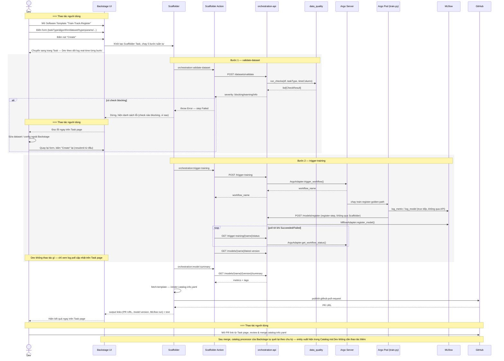
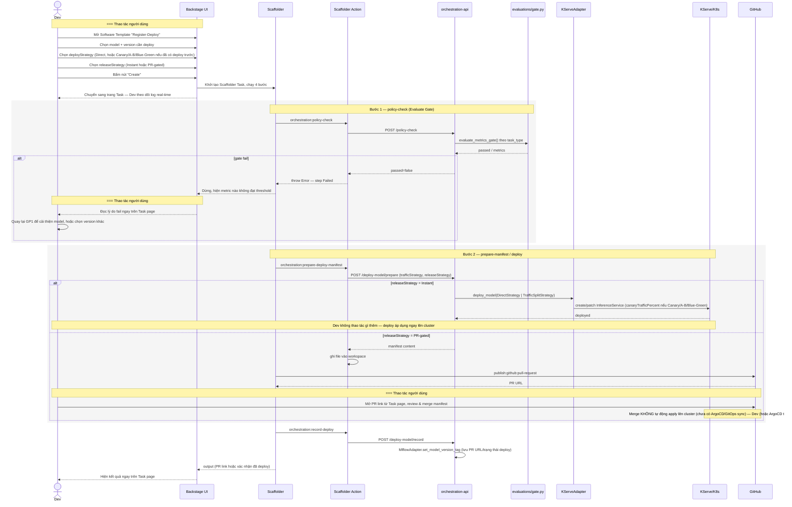

# MLOps Lifecycle — Software Template Redesign

> **Trạng thái:** Mục 3 (Golden Path #1) **đã duyệt**, đang chờ thực thi (xem
> task list phiên làm việc). Mục 4 (Golden Path #2) **thiết kế xong trong
> thảo luận, chưa có task cụ thể, chưa code** — cần xác nhận sequencing
> trước khi bắt đầu. Tài liệu này là bản tham chiếu đầy đủ cho phase dev
> tiếp theo, viết ngày 2026-08-26.

## 1. Bối cảnh & vấn đề

Golden Path #1 (`examples/templates/train-track-register/template.yaml`)
hiện chỉ có 2 bước, và toàn bộ pipeline train
(`infra/argo-workflows/train-register-template.yaml` +
`fine-tune-template.yaml`) hardcode cứng vào 1 use case: cột nhãn
`is_fraud`, cột loại bỏ `transaction_id`, encode cứng `merchant_category`,
và duy nhất thuật toán `LogisticRegression`. `evaluations/gate.py` cũng chỉ
có 1 bộ ngưỡng accuracy/precision/recall — chỉ đúng cho classification.

Golden Path #2 (`examples/templates/register-deploy/template.yaml`) chỉ có
1 cách deploy: Evaluate Gate rồi thay thế toàn bộ (`adapters/kserve_adapter.py`
tạo 1 `InferenceService` duy nhất, không dùng field `canaryTrafficPercent`
mà KServe đã hỗ trợ sẵn). Không có lựa chọn nào hiện ra cho Dev — muốn deploy
khác đi (canary, A-B) phải tự viết lại code/manifest.

## 2. Nguyên tắc thiết kế chung (áp dụng xuyên suốt cả 2 Golden Path)

Cốt lõi triết lý Golden Path: **Dev không cần biết cách viết manifest, thiết
lập deploy, hay cơ chế ML bên dưới — chỉ cần chọn 1 tuỳ chọn có ý nghĩa
nghiệp vụ.** Nhưng không phải mọi bước đều xứng đáng có 1 lựa chọn hiện ra —
cần phân biệt 2 khái niệm:

- **Strategy Pattern trong code**: nhiều class cùng implement 1 interface
  (đúng khuôn `adapters/interfaces.py` đã dùng xuyên suốt dự án), chọn 1 lúc
  chạy.
- **Lựa chọn hiện ra cho Dev**: có nên bắt Dev tự chọn qua form Software
  Template hay không — đây là quyết định UX, độc lập với việc có Strategy
  Pattern trong code hay không.

**Quy tắc phân loại:** nếu đánh đổi thuộc về **nghiệp vụ/rủi ro** (Dev hiểu
và cần chịu trách nhiệm về lựa chọn) → hiện ra cho Dev chọn. Nếu đánh đổi
thuộc về **cơ chế ML/hạ tầng thuần kỹ thuật** (có đáp án đúng-sai rõ ràng
theo ngữ cảnh, không phải sở thích) → platform tự quyết, Dev không cần biết.

| Bước | Strategy Pattern trong code? | Dev chọn? | Lý do |
|---|---|---|---|
| Data ingestion (ETL từ nguồn thô) | Không thêm | — | Không có nguồn thô thật trong dự án (không DB/API ngoài/data lake) — thêm bước này là bịa hạ tầng không có gì chạy phía sau. Golden Path #1 bắt đầu từ dataset đã version hoá (`.dvc`), ETL nằm ngoài phạm vi nền tảng này |
| Feature scaling | Có (mới) | Không — tự động | Thuật toán dựa-trên-khoảng-cách (KNN/SVC/clustering) *bắt buộc* cần scale, thuật toán cây thì không — đây là đúng-sai kỹ thuật, không phải sở thích |
| Model validation (holdout/k-fold) | Có (mới) | Không — tự động | Dataset nhỏ nên ưu tiên k-fold cho ước lượng ổn định hơn — chọn theo cỡ dataset, không phải Dev tự cân nhắc |
| Training algorithm | Có (đã duyệt) | **Có** | Đánh đổi độ chính xác/độ giải thích được — quyết định nghiệp vụ |
| Deploy traffic (Direct/Canary/A-B) | Có (mới) | **Có** | Đánh đổi tốc độ/rủi ro deploy — quyết định nghiệp vụ |
| Release (PR-gated/Instant) | Có (mới) | **Có** | Cùng lý do — ai chịu trách nhiệm duyệt thay đổi |

## 3. Golden Path #1 — Train→Track→Register (tổng quát hoá) — ĐÃ DUYỆT

### 3.1 Training image mới (thay heredoc + pip install lúc chạy)

`infra/argo-workflows/training-image/` — Docker image build sẵn, không còn
`pip install` lúc chạy (lý do **không chỉ vì best practice**: đây là fix cho
1 bug thật đã gặp trong đồ án — Docker Desktop I/O error khi container tải
gói lúc chạy, xem lịch sử debug `scripts/setup-k8s-local.sh`). Code Python
thật (không phải nhúng trong YAML) để lint/type-check/test được qua
`make check`, đúng `.claude/rules/python-standards.md`:

- **`algorithm_registry.py`** — `TASK_TYPE_ALGORITHMS: dict[str, dict[str, type]]`,
  ~18 thuật toán phủ đủ các họ chính, mỗi entry có cờ `requires_scaling: bool`:
  - classification: `LogisticRegression, RandomForestClassifier,
    GradientBoostingClassifier, KNeighborsClassifier, SVC, GaussianNB,
    XGBClassifier, LGBMClassifier, CatBoostClassifier`
  - regression: `LinearRegression, Ridge, Lasso, RandomForestRegressor,
    GradientBoostingRegressor, SVR, XGBRegressor, LGBMRegressor,
    CatBoostRegressor`
  - clustering: `KMeans, DBSCAN, AgglomerativeClustering, GaussianMixture`
    (XGBoost/LightGBM/CatBoost chỉ làm supervised, không có bản clustering).
  - Đây là registry pattern — hỗ trợ được bất kỳ estimator sklearn nào (cùng
    interface `fit`/`predict`) chỉ bằng cách thêm 1 dòng, không cần liệt kê
    hết 60+ estimator sklearn vào 1 dropdown.
  - **XGBoost/LightGBM/CatBoost không phải thuộc scikit-learn** — là 3
    package riêng biệt, nhưng đều tự cung cấp class tương thích chuẩn
    scikit-learn (`fit`/`predict`) nên khớp thẳng vào registry pattern
    trên, không cần thiết kế riêng. Theo dữ liệu khảo sát ngành (Kaggle
    ML/DS Survey), đây là các thuật toán được dùng nhiều nhất thực tế cho
    dữ liệu bảng — quan trọng hơn cả `GradientBoostingClassifier`/
    `Regressor` (bản gradient boosting nội bộ của sklearn, chậm hơn). Cả 3
    đều `requires_scaling=False` (tree-based/boosting, không cần chuẩn hoá
    đặc trưng — cùng nguyên tắc RandomForest/GradientBoosting đã có). Thêm
    `xgboost`, `lightgbm`, `catboost` vào `requirements.txt` training image.
  - **Lưu ý CatBoost**: có khả năng xử lý cột categorical trực tiếp (qua
    tham số `cat_features`), không cần encode trước — đây là lợi thế riêng
    của thư viện. Bản thiết kế hiện tại vẫn áp dụng đồng nhất bước tự động
    ordinal-encode mọi cột `dtype=object` (mục trên) cho MỌI thuật toán kể
    cả CatBoost, để giữ `train.py` đơn giản/nhất quán — chấp nhận không tận
    dụng hết lợi thế categorical-native của CatBoost ở bản đầu tiên; đây là
    điểm có thể tối ưu sau nếu cần, không phải lỗi thiết kế.
- **`metrics.py`** — `compute_metrics(task_type, y_true, y_pred) -> dict`:
  - classification: accuracy/precision/recall/**f1** (bổ sung 2026-08-28,
    theo yêu cầu review) với `average="weighted"` (sửa lỗi tổng quát hiện
    tại chỉ đúng cho binary) — `f1` cũng có ngưỡng gate riêng (`minimum=0.6`,
    khớp precision/recall), đúng metric phản ánh trực tiếp mất cân bằng lớp
    mà `check_class_imbalance` (mục 6f) đã cảnh báo riêng.
  - regression: `r2_score` + `mean_absolute_percentage_error` — cả 2
    scale-free, đặt ngưỡng mặc định hợp lý mà không cần biết đơn vị dataset.
    **Bổ sung `mean_absolute_error`** (2026-08-28) — CHỈ log, không có
    ngưỡng gate (không scale-free, không đặt ngưỡng mặc định hợp lý được
    nếu không biết đơn vị dataset — cùng cách xử lý `map_at_k` của RecSys,
    mục 6e.3).
  - clustering: `silhouette_score` — bị chặn trong [-1,1], scale-free.
- **`train.py`** — đọc `DATASET_URI`, `TASK_TYPE`, `TARGET_COLUMN` (rỗng nếu
  clustering), `ID_COLUMNS` (thay hardcode `transaction_id`), `ALGORITHM`,
  `MODE` (train/finetune), `BASE_MODEL_URI`, `TIME_COLUMN` (optional). Tự
  động ordinal-encode mọi cột `dtype=object` thay vì hardcode tên cột
  `merchant_category`. Tự động chọn chiến lược validation theo dữ liệu:
  - Nếu `TIME_COLUMN` được cung cấp (classification/regression) → luôn dùng
    `sklearn.model_selection.TimeSeriesSplit` (sort theo `TIME_COLUMN`,
    không bao giờ shuffle) — random holdout/k-fold để dữ liệu tương lai lọt
    vào train sẽ cho metric sai lệch nhưng trông vẫn đẹp, bất kể dataset lớn
    hay nhỏ. Không áp dụng cho clustering (thiết kế hiện tại không có
    train/test split cho clustering).
  - Nếu không có `TIME_COLUMN` → holdout hay k-fold cross-validation theo cỡ
    dataset (dataset nhỏ → k-fold cho ước lượng ổn định hơn), như thiết kế
    gốc.

  Tự động áp `StandardScaler` khi `requires_scaling=True`. Ghi log MLflow
  kèm tag `task_type`.
- **`tests/`** — pytest cho registry + metrics dispatch, chạy qua
  `make check` sau khi thêm vào `Makefile` `SERVICE_REQS`.

Theo đúng quy tắc `CLAUDE.md` "Adding a new Python service": thêm
`requirements.txt` vào `SERVICE_REQS`, `make lock`, thêm build+scan block vào
`ci.yml`. **Lệch có chủ đích**: không thêm vào `docker-compose.yml` — đây là
batch-job image Argo chạy, không phải service có cổng/healthcheck.

### 3.2 Gộp 2 WorkflowTemplate thành 1

`train-register-template.yaml` + `fine-tune-template.yaml` giống hệt nhau ở
`register-step`. Gộp thành 1 `WorkflowTemplate` (`train-register-golden-path`)
với tham số `mode` (`train`/`finetune`), dùng chung training image.
`routers/models.py trigger_training()` bỏ nhánh chọn template theo
`base_model_uri`, chỉ còn submit 1 template kèm `mode`. Fine-tune
(`warm_start=True`) chỉ khả dụng với thuật toán hỗ trợ `warm_start` (linear
models, `RandomForest*` qua tăng `n_estimators`) — thuật toán khác báo lỗi rõ
ràng trong `train.py`, không âm thầm bỏ qua.

### 3.3 Evaluate Gate tổng quát theo task type

`services/orchestration-api/evaluations/gate.py`:

```python
@dataclass
class MetricThreshold:
    metric: str
    minimum: float | None = None  # "càng cao càng tốt"
    maximum: float | None = None  # "càng thấp càng tốt"


TASK_TYPE_THRESHOLDS: dict[str, list[MetricThreshold]] = {
    "classification": [MetricThreshold("accuracy", minimum=0.7), ...],
    "regression": [
        MetricThreshold("r2", minimum=0.5),
        MetricThreshold("mean_absolute_percentage_error", maximum=0.3),
    ],
    "clustering": [MetricThreshold("silhouette_score", minimum=0.25)],
}


def evaluate_metrics_gate(task_type: str, metrics: dict[str, float]) -> dict: ...
```

`policy_check()` đọc tag `task_type` đã lưu lúc `register_model()` (tham số
mới trong `RegisterModelRequest`) để chọn đúng bộ ngưỡng — Backstage không
cần gửi lại `taskType` ở bước deploy.

### 3.4 Bước mới cho Golden Path #1 (2 → 5 bước)

`examples/templates/train-track-register/template.yaml`:

1. **`validate-dataset`** (mới, `orchestration:validate-dataset` →
   `POST /datasets/validate`) — đọc header CSV, kiểm tra `targetColumn` tồn
   tại (nếu supervised), fail nhanh trước khi tốn thời gian chạy Argo.
2. **`trigger-training`** (đã có, tổng quát hoá: `taskType`, `targetColumn`
   optional, `algorithm`, `idColumns` optional).
3. **`model-summary`** (mới, `orchestration:model-summary` →
   `GET /models/{name}/{version}/summary`) — hiển thị task_type + metrics
   ngay trong lúc chạy template.
4. **`render-catalog-info`** (đã có, `fetch:template`, không đổi).
5. **`publish-catalog-pr`** (mới, `publish:github:pull-request`, cùng khuôn
   `register-deploy` đang dùng) — sửa đúng giới hạn đã biết ("catalog entry
   chưa từng live") bằng cách thật sự mở PR. Cần thêm parameter `repoUrl`.

Form parameters thêm `taskType` (enum 3 giá trị) và `algorithm` (enum đổi
theo `taskType` qua JSON Schema `allOf`/`if-then`, Backstage Scaffolder
v1beta3 hỗ trợ); `targetColumn` chỉ `required` khi `taskType` là
classification/regression. Thêm `timeColumn` (string, optional, không cần
enum) — mô tả rõ trong form: "để trống nếu dữ liệu không có thứ tự thời
gian; nếu có, điền đúng tên cột ngày/giờ để tránh rò rỉ dữ liệu tương lai
vào tập train".

### 3.5 Dataset mẫu mới

`data/house-price-sample.csv` (+ `.dvc`) — dataset regression tự tạo, cùng
khuôn `fraud-detection-sample.csv`, không có cột định danh. Test clustering
dùng lại 2 dataset có sẵn (bỏ `targetColumn`). Cập nhật `data/README.md`.

### 3.6 File khác cần sửa theo (đồng bộ, không đổi thiết kế)

`routers/models.py` (task_type plumbing + `time_column: str | None = None`
trong `trigger_training` request, forward xuống Argo Workflow parameter + 2
endpoint mới), `mlopsActions.ts`
(2 action mới + cập nhật `createTriggerTrainingAction`),
`tests/test_gate.py`, `tests/test_models_router.py`, `mlopsActions.test.ts`,
`docs/playbook-ai-delivery-portal.md` (nếu còn nhắc fraud-detection như ví
dụ cố định duy nhất).

## 4. Golden Path #2 — Register→Deploy (tổng quát hoá) — MỚI, CHƯA CODE

### 4.1 Insight kỹ thuật nền tảng

Trong KServe, **Canary và A-B Testing dùng chung 1 cơ chế**:
`canaryTrafficPercent` trên `InferenceService` (chia % traffic giữa 2
revision). Khác nhau ở *ý định/thời lượng*, không phải cơ chế:
- **Canary**: % tăng dần theo thời gian, mục tiêu tiến tới 100% (thay thế
  hoàn toàn, phát hiện lỗi sớm).
- **A-B Testing**: % cố định, giữ đủ lâu để so sánh, không nhất thiết tiến
  tới 100% cho bên nào.

Nên về kiến trúc, đây là **1 strategy kỹ thuật** ("traffic-split") với 2
preset khác nhau — không phải 2 cơ chế riêng biệt.

### 4.2 Hai interface độc lập

Theo đúng khuôn `adapters/interfaces.py` (Adapter Pattern đã dùng xuyên suốt
dự án — thêm 1 class mới, không đụng caller):

**`IDeployTrafficStrategy`** — traffic đi thế nào:
- `DirectStrategy` (hiện có, không đổi) — 1 `InferenceService`, thay 100%
  ngay sau Evaluate Gate. Ghi chú: Knative Serving (nền tảng KServe) đã tự
  thay pod dần + dùng readiness probe để tránh downtime khi có nhiều
  replica — hành vi gần giống "Rolling deployment" đã có sẵn miễn phí, nên
  không cần thêm "Rolling" như 1 lựa chọn riêng.
- `TrafficSplitStrategy` (mới) — dùng chung field `canaryTrafficPercent`/
  `spec.traffic` của KServe (Revision cũ vẫn được GIỮ LẠI khi Revision mới
  sẵn sàng, không xoá ngay — đây là lý do cả 3 preset dưới đây cùng 1 cơ chế
  kỹ thuật):
  - preset **canary**: % khởi tạo thấp, tăng dần theo thời gian (config: %
    ban đầu, bước tăng, khoảng thời gian mỗi bước).
  - preset **A-B**: % cố định (config: % cố định, thời hạn chạy).
  - preset **blue-green** (mới): chuyển thẳng 0%→100% (không tăng dần),
    giữ rõ Revision cũ để rollback tức thời bằng cách route traffic ngược
    lại — khớp đúng ngữ nghĩa Blue-Green kinh điển, không cần cơ chế riêng.
- **Ràng buộc**: Canary/A-B/Blue-Green chỉ có nghĩa khi model đã có ≥1
  version deploy trước đó (cần cái để so sánh/rollback về) — form chỉ hiện
  các lựa chọn này khi đã tồn tại deploy trước; Direct luôn khả dụng kể cả
  lần deploy đầu tiên.

**Đã cân nhắc và KHÔNG thêm — Recreate, Shadow:**
- **Recreate** (tắt hẳn bản cũ rồi mới bật bản mới, chấp nhận downtime):
  Knative/KServe mặc định đã TRÁNH downtime — để có đúng ngữ nghĩa Recreate
  phải chủ động cấu hình ra hành vi TỆ HƠN mặc định. Không có lý do kỹ
  thuật để làm vậy cho model serving (không có ràng buộc tài nguyên độc
  quyền như ứng dụng stateful truyền thống).
- **Shadow** (mirror request thật tới cả 2 bản, ẩn kết quả bản mới, chỉ
  ghi log): cơ chế mirror traffic thường cần **service mesh** (Istio, qua
  `mirror` trong VirtualService) — dự án hiện KHÔNG có service mesh trong
  hạ tầng (`infra/` chỉ có monitoring/vector-dbs/llm-gateways). Thêm Shadow
  đồng nghĩa thêm 1 tầng hạ tầng hoàn toàn mới, không phải chỉ thêm code —
  đi ngược giá trị "không thêm hạ tầng không cần thiết". Ghi nhận là
  stretch goal tương lai nếu dự án từng có lý do khác để thêm service mesh.

**`IReleaseStrategy`** — thay đổi được duyệt thế nào (trục **độc lập** với
trên):
- `PRGatedStrategy` (hiện có, không đổi) — mở PR, cần merge, ArgoCD sync
  (khi có) mới thật sự deploy.
- `InstantStrategy` (mới) — gọi thẳng orchestration-api, không qua PR/Git.

### 4.3 Phạm vi rõ ràng — không tự động promote/rollback

Cả `DirectStrategy` lẫn `TrafficSplitStrategy` chỉ **render đúng
manifest/PR theo strategy đã chọn**. Việc theo dõi metric traffic-split rồi
tự động quyết định tăng % / rollback **KHÔNG nằm trong phạm vi đợt này** —
đó là bài toán progressive delivery riêng (gần với Argo Rollouts/Flagger),
cần 1 controller theo dõi liên tục, khác hẳn quy mô 1 Golden Path chạy 1
lần. Người dùng vẫn theo dõi/merge/điều chỉnh % thủ công sau khi chọn
strategy — nhất quán với quyết định đã chốt trước đây (MLOps deploy dừng ở
PR, không tự động sync ArgoCD).

### 4.4 File cần sửa (khi triển khai)

- `adapters/interfaces.py` — thêm `IDeployTrafficStrategy`, `IReleaseStrategy`.
- `adapters/kserve_adapter.py` — `deploy_model()` nhận traffic strategy thay
  vì luôn tạo 1 `InferenceService` cố định.
- `routers/models.py` — `/deploy-model/prepare` nhận `traffic_strategy`
  (+ config preset) và `release_strategy`; endpoint mới hoặc nhánh xử lý cho
  `InstantStrategy` (gọi thẳng thay vì trả manifest để publish PR).
- `examples/templates/register-deploy/template.yaml` — thêm 2 parameter
  dropdown (`deployStrategy`, `releaseStrategy`), điều kiện hiện Canary/A-B
  chỉ khi đã có deploy trước (cần gọi 1 action kiểm tra trước, hoặc dùng
  JSON Schema conditional nếu Backstage hỗ trợ tra cứu — cần xác nhận khả
  thi lúc triển khai).
- `mlopsActions.ts` — action `prepare-deploy-manifest`/`policy-check` truyền
  thêm 2 tham số strategy.

### 4.5 Đã code — 2 tinh chỉnh so với 4.4 lúc triển khai thật

- **`policy-check` không cần 2 tham số strategy** — rà lại thấy không hợp
  lý (chỉ chạy Evaluate Gate theo metric, không liên quan traffic/release).
  Chỉ `prepare-deploy-manifest` nhận `trafficStrategy`/`trafficPercent`/
  `releaseStrategy`.
- **Không dùng JSON Schema conditional ẩn/hiện Canary/A-B/Blue-Green** —
  xác nhận Backstage Scaffolder v1beta3 chỉ conditional được theo field
  khác trong form, không tra cứu được cluster state. Xử lý ở backend thay
  vào đó: `Direct` luôn hiện, `prepare_deploy_manifest()` tự chặn kèm lỗi
  rõ ràng nếu chọn Canary/A-B/Blue-Green cho model chưa từng deploy.

**Bug thật phát hiện khi code**: `KServeAdapter.deploy_model()` cũ chỉ gọi
`create_namespaced_custom_object` — deploy lần 2 cho cùng model sẽ lỗi
"already exists". Đã sửa thành patch-trước-rồi-create-nếu-404.

`adapters/deploy_strategies.py` — 4 class: `DirectStrategy`/
`TrafficSplitStrategy` (`IDeployTrafficStrategy`), `PRGatedStrategy`/
`InstantStrategy` (`IReleaseStrategy`). `KServeAdapter` luôn khởi tạo
**lazy trong request handler**, không phải singleton module-level như
`mlflow_adapter`/`argo_adapter` — `__init__` gọi `config.load_kube_config()`
ngay lập tức, sẽ crash lúc khởi động orchestration-api ở mọi môi trường
không có kubeconfig hợp lệ (container hiện tại, CI, dev chưa chạy `kind`).

## 4b. Hạ tầng GitOps cho Golden Path #2 — ArgoCD + Helm + KServe Serverless

**Phát hiện quan trọng lúc chuẩn bị code mục 4**: KServe/Knative Serving —
thứ thực sự chạy `InferenceService` — **chưa từng được cài** trên `kind`
(chỉ có Argo Workflows). Không có KServe thì dù `IDeployTrafficStrategy`
code đúng, cũng không có gì thực thi. Đã dựng hạ tầng này trước khi code
mục 4, theo đúng version đã tra cứu: cert-manager v1.21.1, Knative Serving
v1.23.0, Kourier v1.23.0 (**không dùng Istio** — nhẹ hơn, đúng nguyên tắc
"không thêm hạ tầng không cần thiết"), KServe v0.20.0, ArgoCD v3.5.1 —
script `scripts/setup-kserve-argocd-local.sh`.

**Chọn Serverless mode (không phải RawDeployment)** — giữ đúng cơ chế
`canaryTrafficPercent`/Knative Revision mà `IDeployTrafficStrategy` (mục
4.2) đã thiết kế; RawDeployment không có cơ chế này.

**3 ArgoCD Application** (`infra/argocd/`) — tại thời điểm viết mục này.
Đã tái cấu trúc thành multi-env × multi-tenant (`ApplicationSet`/
`AppProject`, xem `infra/argocd/README.md`) — lý do gốc bên dưới vẫn đúng,
chỉ tên file/số lượng đã đổi:
- `inference-services-app.yaml` — `directory` source trỏ
  `infra/inference-services/` (đã là YAML phẳng, không cần Helm) — đóng
  đúng gap "merge PR không làm gì" của Golden Path #2.
- `orchestration-api-app.yaml`/`portal-app.yaml` — `source.helm` trỏ
  `infra/helm-charts/orchestration-api`/`portal` (2 Helm chart mới, **bổ
  sung cho `docker compose up -d`/`yarn start`, không thay thế** — vòng
  lặp dev hàng ngày không đổi gì).

**Helm chỉ 2 chart, không phải 4 như `infra/helm-charts/README.md` dự kiến
ban đầu**: khảo sát `docker-compose.yml` phát hiện 3 MCP server
(`mlops-server`/`k8s-server`/`metrics-server`) là **stdio-transport,
`profiles: ["manual"]`** — chỉ spawn theo yêu cầu, không phải service
chạy liên tục. Deploy thành K8s Deployment sẽ crash-loop (không có stdin
gắn vào). Chỉ `orchestration-api` và Portal Backstage (2 service chạy
liên tục thật) có Helm chart. Portal dùng `app-config.yaml` (dev-mode,
SQLite in-memory) thay vì `app-config.production.yaml` — Postgres hiện
không tồn tại ở đâu trong project.

## 5. Phase 3 — Deep Learning (MLP + LSTM), làm SAU mục 3 và mục 4

**Đính chính quan trọng:** KServe phục vụ mọi flavor MLflow (sklearn/pytorch/
tensorflow) qua cùng 1 servingRuntime `"mlflow"` — nên `adapters/
kserve_adapter.py` **không cần đổi vì Deep Learning**, miễn model luôn được
log qua đúng flavor MLflow (`mlflow.pytorch.log_model()`). Lý do "cần
serving runtime khác" từng dùng để hoãn DL trước đây không hoàn toàn đúng —
sửa lại ở đây.

### 5.1 Vì sao tách registry riêng, không dùng chung `algorithm_registry.py`

Kiến trúc mạng nơ-ron không có interface đồng nhất như sklearn (`fit`/
`predict`) — MLP và LSTM có bộ hyperparameter khác cấu trúc hoàn toàn. Thêm
`infra/argo-workflows/training-image/dl_architecture_registry.py`:

```python
DL_ARCHITECTURES = {
    "mlp": {
        "model_class": MLPModel,
        "requires_time_column": False,
        "hyperparameters": ["hidden_layers", "dropout", "learning_rate", "epochs", "batch_size"],
    },
    "lstm": {
        "model_class": LSTMModel,
        "requires_time_column": True,
        "hyperparameters": [
            "sequence_length",
            "num_layers",
            "hidden_size",
            "learning_rate",
            "epochs",
            "batch_size",
        ],
    },
}
```

`timeColumn` (mục 3.1/3.4) **bắt buộc** với LSTM (cần thứ tự để windowing),
vẫn optional với MLP (chỉ cải thiện độ hợp lệ của split, tái dùng nguyên cơ
chế `TimeSeriesSplit` đã có).

### 5.2 Script train riêng — `train_dl.py`

Training loop DL (epoch/batch/backprop, log metric theo epoch) khác hẳn
hình dạng sklearn (1 lệnh `.fit()`) — tách file riêng trong cùng training
image (mục 3.1), không nhét vào `train.py`. Có thể cần thêm `torch` vào
`requirements.txt` của training image, hoặc tách thành image DL riêng nếu
kích thước quá lớn — quyết định cụ thể để lúc triển khai.

### 5.3 Dataset mới cho DL

Dataset demo hiện có (fraud-detection ~10-15 dòng, house-price tương tự) quá
nhỏ để DL học được tín hiệu thật — chắc chắn overfit, không chứng minh được
giá trị cốt lõi của deep learning. Thêm **1 dataset tổng hợp mới** (tự sinh,
không tải ngoài), đủ lớn (vài trăm–vài nghìn dòng), có sẵn cột thời gian —
dùng chung cho cả MLP (qua `timeColumn` optional) lẫn LSTM (qua windowing
bắt buộc), thay vì tách 2 dataset riêng.

### 5.4 Tái dùng nguyên vẹn, không thiết kế lại

`evaluations/gate.py` (`TASK_TYPE_THRESHOLDS` theo mục 3.3), 2 interface
`IDeployTrafficStrategy`/`IReleaseStrategy` (mục 4), cấu trúc 5 bước của
`train-track-register/template.yaml` (mục 3.4) — DL chỉ là 1 họ thuật toán
khác trong classification/regression, không phải task_type mới, không cần
thiết kế lại Evaluate Gate hay Golden Path #2.

Mở rộng `template.yaml`: thêm nhánh JSON Schema `if/then` cho `architecture`
(`sklearn`/`mlp`/`lstm`), mỗi lựa chọn hiện đúng field hyperparameter tương
ứng — cùng kỹ thuật đã dùng cho `algorithm` theo `taskType` (mục 3.4).

### 5.5 Đã code — tinh chỉnh so với 5.1-5.4 lúc triển khai thật

- **`train_dl.py` tách file riêng** (đúng 5.2), nhưng **dispatch nằm trong
  `train.py`** chứ không phải entrypoint/container riêng — `main()` đọc
  `ARCHITECTURE` (mặc định `sklearn`), rẽ nhánh sau khi `_split()` (dùng
  chung nguyên vẹn với sklearn). `_handle_missing_values`/`_scale_features`
  sklearn-style **không dùng cho DL** — `train_dl.py` luôn tự
  chuẩn hoá (mean/std), không có cờ bật/tắt như `AlgorithmSpec.requires_scaling`.
- **torch CPU-only**: `--extra-index-url https://download.pytorch.org/whl/cpu`
  + `torch==2.13.0` trong `requirements.txt` — không có GPU trên `kind`
  cluster, tránh kéo theo gói CUDA vô dụng (cùng loại vấn đề đã gặp với
  `nvidia-nccl-cu12` ở `xgboost`). Kéo theo 2 lần chỉnh
  `--index-strategy unsafe-best-match`: 1 lần ở `Makefile`'s `lock` target
  (compile-time — nếu không, `uv pip compile` từ chối resolve các gói không
  liên quan gì đến torch, ví dụ `qdrant-client`/`dvc`, vì mặc định chỉ tin
  index đầu tiên chứa 1 tên gói) và 1 lần **thêm mới** ở
  `training-image/Dockerfile`'s `uv pip install` (install-time — lock file
  giờ tự khai `--extra-index-url` qua `--emit-index-url`, nên `uv pip
  install` bên trong container cũng cần cờ này để không từ chối resolve
  `certifi`/các gói khác quá phiên bản có trên riêng
  `download.pytorch.org`).
- **LSTM windowing xảy ra sau `_split()`** — `build_sequences()` chạy riêng
  trên phần train và phần test, chấp nhận mất vài dòng biên thay vì
  windowing rồi mới chia.
- **Optimizer ban đầu cố định Adam, sau đổi thành lựa chọn Dev-facing
  `adam`/`sgd`** — xem điểm "đã CHỐT" ngay trước mục 7b.4 để biết quyết
  định cuối và `optimizers.py`. `CrossEntropyLoss` dùng chung cho classification
  (kể cả nhị phân, qua `output_size = train_labels.nunique()`), target
  regression cũng được chuẩn hoá (mean/std lưu riêng, un-scale trước khi
  gọi `compute_metrics()` vì R2/MAPE cần giá trị đúng thang đo gốc).
  `mlflow.log_metric("loss", value, step=epoch)` mỗi epoch — tái dùng UI
  MLflow có sẵn, cùng tinh thần mục 6c.3.
- **Lỗi môi trường phát hiện lúc code** (không phải lỗi thiết kế): trên máy
  dev macOS, import `xgboost`/`lightgbm` (hoặc gián tiếp qua
  `algorithm_registry.py`) trước `torch` trong cùng 1 process làm segfault ở
  lần gọi `CrossEntropyLoss` đầu tiên — 2 runtime OpenMP xung đột. Fix bằng
  cách ép `torch` import trước (`train.py` có `import torch` tường minh
  trước `algorithm_registry`; bộ test có `tests/conftest.py` làm điều tương
  tự cho cả pytest process). Chỉ ảnh hưởng macOS dev venv — image Docker
  thật chạy Linux, không gặp lỗi này.

## 6. Trạng thái từng phần — thứ tự tuyến tính đã chốt (MLOps xong hết mới tới LLMOps)

Toàn bộ đã được sắp xếp thành **1 chuỗi phụ thuộc tuyến tính duy nhất**
trong task list (mỗi phase `blockedBy` task cuối của phase trước):

| Phase | Nội dung | Task | Trạng thái |
|---|---|---|---|
| 1 | Golden Path #1 — Classical ML (mục 3) | #9–18 | **Đã code + commit** (training image, data quality, gate, 5-step template) |
| 2 | Golden Path #2 — Deploy Strategy (mục 4) | #24–29 | **Đã code + commit** (`adapters/deploy_strategies.py`, KServe create-or-update fix, mục 4.5). Hạ tầng chạy thật (ArgoCD + Helm + KServe Serverless trên kind, mục 4b) cũng đã dựng xong — chạy thử end-to-end được ngay |
| 3 | Deep Learning — MLP+LSTM (mục 5) | #19–23 | **Đã code + commit** (`dl_models.py`, `dl_architecture_registry.py`, `train_dl.py`, dispatch trong `train.py`, dataset `sensor-timeseries-sample.csv`, mục 5.5). `docker build` của `training-image` đã verify thành công (image build cùng lúc với các phụ thuộc Phase 4-8, xem mục 6e.5) |
| 4 | BYOC — custom script (mục 6b.3) | #30–34 | **Đã code + commit** (`byoc_runner.py`, `pyfunc_wrapper.py`, dispatch trong `train.py`, mục 6b.3.1). `docker build` đã verify thành công (cùng lần build mục 8, xem mục 6e.5) |
| 5 | HPO — Grid/Random/Bayesian (mục 6c) | #35–37 | **Đã code + commit** (`hpo_strategies.py`, `hpo_runner.py`, dispatch trong `train.py`, mục 6c.5). `docker build` đã verify thành công (cùng lần build mục 8, xem mục 6e.5) |
| 6 | NLP — text classification (mục 6g, thiết kế chi tiết) | #38 | **Đã code + commit** (`train_nlp.py`, dispatch trong `train.py`, mục 6g.6). `docker build` đã verify thành công (cùng lần build mục 8, xem mục 6e.5) |
| 7 | CV — image classification (mục 6h, thiết kế chi tiết) | #39 | **Đã code + commit** (`train_cv.py`, dispatch trong `train.py`, dataset `shapes-sample.zip`, mục 6h.6). `docker build` đã verify thành công (cùng lần build mục 8, xem mục 6e.5) |
| 8 | RecSys — Golden Path riêng (mục 6e, thiết kế đầy đủ) | #41–46 | **Đã code + commit** (`rec_algorithm_registry.py`, `rec_metrics.py`, `train_rec.py`, `rec-train-register-template.yaml`, `routers/recommendations.py`, template `recommend-train-register`, mục 6e.5). `docker build training-image` đã verify thành công (bao gồm `implicit`/`scikit-surprise`) |
| 9 | Model Monitoring — "Setup Model Monitoring" (mục 6d) | #47–50 | **Đã code + commit** (`monitor_drift.py`, `monitor-drift-template.yaml`, `routers/monitoring.py`, `ArgoAdapter.create_cron_workflow()`, template `setup-model-monitoring`, mục 6d.7). `docker build` đã verify thành công (bao gồm `evidently`) — image + smoke test import (`train`/`train_dl`/`train_nlp`/`train_cv`/`train_rec`/`monitor_drift`) đều pass trong container Linux thật. CronWorkflow REST call vẫn chưa kiểm chứng với Argo Server thật (chỉ unit test mock) |
| — | RL | — | Không hỗ trợ — giới hạn kiến trúc |
| — | LLMOps (`docs/llmops-lifecycle-plan.md`) | Không tạo task | **Đã CHỐT (không còn DRAFT) sau khi toàn bộ 9 phase MLOps trên hoàn thành và verify xong — kế hoạch triển khai chi tiết, chưa code** |

**Data Quality/EDA (mục 6f)** không phải 1 phase riêng — là 1 thiết kế xuyên suốt, cập nhật vào mô tả task #9/#12/#14/#42 (xem 6f.3).

## 6b. Phase 4+ — Đa tầng ML/DL cho nhiều team (nghiên cứu CV/NLP/RecSys/RL, BYOC)

Sau khi nghiên cứu kỹ CV/NLP/Recommendation System/Reinforcement Learning
(qua 4 agent song song, 2026-08-27) và thiết kế thêm khả năng Dev tự viết
code training (Bring-Your-Own-Code), câu hỏi "tích hợp tất cả framework
ML/DL hiện có" được trả lời bằng **kiến trúc phân tầng (tiering)**, không
phải 1 cơ chế làm được mọi thứ — mỗi tầng phục vụ đúng 1 nhóm nhu cầu, tất
cả dùng chung 1 xương sống quản trị (MLflow tracking/registry, Evaluate Gate
theo `task_type`, `IDeployTrafficStrategy`/`IReleaseStrategy`, MLOps
Dashboard).

### 6b.1 Kết quả nghiên cứu (tóm tắt, xem báo cáo gốc để biết chi tiết/nguồn)

- **Computer Vision — PARTIALLY FEASIBLE, phạm vi hẹp.** Chỉ torchvision
  image classification (không detection/segmentation — Detectron2/
  MMDetection nặng, hướng GPU, không hợp `kind` cluster CPU-only). Dữ liệu
  ảnh cần đóng gói thành 1 file zip track qua DVC — DVC chậm hẳn khi track
  hàng nghìn file ảnh lẻ trực tiếp. Serving cần tự viết 1
  `mlflow.pyfunc.PythonModel` wrapper (không có flavor MLflow sẵn cho ảnh),
  chạy trên đúng KServe runtime `"mlflow"` hiện có — không cần runtime mới.
- **NLP — PARTIALLY FEASIBLE, khớp gần nhất với convention hiện tại.** Chỉ
  text classification (không NER — cần format token-level BIO-tagged, khác
  hẳn CSV). HuggingFace `Trainer` (+ LoRA/PEFT tuỳ chọn), gần như tái dùng
  nguyên CSV + `targetColumn` (chỉ thêm `textColumn`). `mlflow.transformers`
  có flavor sẵn, chạy được trên runtime `"mlflow"` hiện có mà không cần
  runtime HuggingFace/Triton chuyên biệt của KServe (tránh thêm hạ tầng
  không cần thiết).
- **Recommendation System — PARTIALLY FEASIBLE nhưng không nên nhét vào
  dropdown `algorithm` hiện có.** Dữ liệu là ma trận tương tác user-item
  (không phải 1 dòng/1 mẫu độc lập), metric là ranking (recall@k/NDCG/MAP,
  không phải accuracy/precision/R²) — khác cấu trúc tận gốc, không phải chỉ
  khác thuật toán. Nên là **1 Golden Path hoàn toàn riêng** (dataset
  contract riêng, evaluate step riêng), không ép vào Golden Path #1.
- **Reinforcement Learning — NOT REALISTIC với kiến trúc hiện tại.** Phá vỡ
  mọi giả định nền tảng của Golden Path #1: không có dataset tĩnh để ingest
  (cần environment/simulator sinh dữ liệu trực tiếp lúc train); không train
  1 lần (cần vòng lặp tương tác hàng nghìn–triệu step); không đánh giá 1
  lần bằng ngưỡng số (cần chạy nhiều episode, đo xu hướng reward theo thời
  gian); không serving dạng request/response (chính sách RL thường nhúng
  trực tiếp vào vòng lặp điều khiển liên tục, không phải endpoint HTTP vô
  trạng thái). **Quyết định: không đưa vào roadmap — đây là giới hạn kiến
  trúc có chủ đích của nền tảng này, ghi nhận rõ thay vì cố nhét 1 demo rời
  rạc không tái dùng được gì từ pipeline hiện có.**

### 6b.2 Bảng phân tầng

| Tầng | Đối tượng phục vụ | Cơ chế | Trạng thái |
|---|---|---|---|
| 1. Paved road — Classical ML | Team làm bài toán bảng biểu phổ biến (fraud, churn, giá) | `algorithm_registry.py` (sklearn) | Đã duyệt — mục 3 |
| 2. Paved road mở rộng — Deep Learning | Team cần hàm phi tuyến phức tạp hơn trên dữ liệu bảng/time-series | `dl_architecture_registry.py` (MLP+LSTM) | Đã duyệt — mục 5 (Phase 3) |
| 3a. Paved road chuyên biệt — NLP | Team làm text classification | HuggingFace `Trainer`, `mlflow.transformers` | Đã code — Phase 6, mục 6g |
| 3b. Paved road chuyên biệt — CV | Team làm image classification | torchvision, custom pyfunc wrapper | Đã code — Phase 7, mục 6h |
| 4. Escape hatch — BYOC | Team có nhu cầu không khớp preset nào | Custom script (contract cố định) trong base image có sẵn | Đề xuất — Phase 5, thiết kế ở 6b.3 |
| 5. Golden Path riêng — RecSys | Team recommendation | Template riêng, dataset/gate riêng | Đề xuất — Phase 6 |
| — | Team làm RL | — | Không hỗ trợ — giới hạn kiến trúc |

**Insight nối các tầng lại:** CV, NLP và BYOC đều cần cùng 1 cơ chế serving
— `mlflow.pyfunc.PythonModel` wrapper tự viết (không có flavor MLflow sẵn
cho ảnh/text/model tuỳ ý). Xây 1 lần, dùng lại cho cả 3 tầng thay vì thiết
kế riêng từng lần.

### 6b.3 Thiết kế BYOC (Phase 5) — "custom script trong base image có sẵn"

Cơ chế đã chọn (không phải custom Docker image tự do — an toàn hơn, giới
hạn đúng bề mặt thực thi, chấp nhận đổi lại là Dev bị giới hạn trong
framework base image đã cài sẵn):

Hợp đồng (contract) cố định — platform không cần hiểu code Dev viết gì, chỉ
cần đúng chữ ký hàm:

```python
def train(dataset: pd.DataFrame, config: dict) -> tuple[Any, dict[str, float]]:
    """Dev tự viết. Trả về (model đã train, dict metric)."""
```

- Dev cung cấp: 1 Git repo URL + đường dẫn file chứa hàm `train()`.
- Argo Workflow thêm 1 bước git-clone (pattern built-in của Argo, không cần
  hạ tầng mới) trước bước train, import động hàm `train()`, gọi với
  `dataset` (đã load theo đúng `DATASET_URI`/`TARGET_COLUMN` như hiện tại)
  và `config` (JSON hyperparameter tự do Dev định nghĩa).
- Platform tự động: mở `mlflow.start_run()`, so `metrics` trả về với đúng
  `TASK_TYPE_THRESHOLDS` (gate không đổi gì), log `model` qua
  `mlflow.pyfunc.PythonModel` wrapper chung (đúng cơ chế dùng lại từ CV/NLP
  ở mục 6b.1) — Dev không cần tự gọi MLflow API.
- Chạy trong **cùng base image + cùng ServiceAccount least-privilege** đã
  có (mục 3.1) — không mở rộng bề mặt bảo mật ở tầng container/cluster, chỉ
  ở tầng "Dev tự viết logic Python nào chạy bên trong".
- `algorithm` field trong `template.yaml` thêm giá trị `custom` — khi chọn,
  hiện 2 field mới: `codeRepoUrl`, `entrypointPath` — cùng kỹ thuật if/then
  JSON Schema đã dùng cho `algorithm`/`architecture`, không phá cấu trúc
  form hiện có.

### 6b.3.1 Đã code — tinh chỉnh so với 6b.3 lúc triển khai thật

- **Git-clone chạy trong `train.py` qua `subprocess`
  (`infra/argo-workflows/training-image/byoc_runner.py`), không phải 1 Argo
  artifact-input step riêng.** Argo Workflows có cơ chế built-in
  `inputs.artifacts[].git` đúng như 6b.3 mô tả, nhưng hành vi của nó khi
  `code-repo-url` rỗng (mọi lần chạy KHÔNG chọn BYOC) không kiểm chứng được
  nếu không có cluster thật để thử — `optional: true` trong tài liệu Argo
  chỉ chắc chắn áp dụng cho S3/GCS/HTTP ("key không tồn tại ở nguồn"), không
  rõ với git repo URL rỗng/không hợp lệ. `subprocess.run(["git", "clone",
  ...], check=True)` bên trong `train.py` cho hành vi xác định, test được
  bằng pytest thuần (mock `subprocess.run`), và lỗi rõ ràng
  (`CalledProcessError` → thông báo "training failed: ..." — cùng cơ chế
  fail hiện có). Đổi lại: image cần thêm gói `git` (đã thêm vào
  `training-image/Dockerfile`, layer cùng `libgomp1`).
- **`algorithm="custom"` được kiểm tra TRƯỚC `architecture`** trong dispatch
  của `train.py::main()` — bỏ qua cả `algorithm_registry.py` lẫn
  `dl_architecture_registry.py`. `architecture` field vẫn giữ giá trị mặc
  định `sklearn` trên form (không dùng tới), tránh phải thêm 1 giá trị
  `architecture=custom` chồng chéo ý nghĩa với `algorithm=custom`.
- **Dataset truyền cho `train()` là `df` thô** (đọc thẳng từ `DATASET_URI`,
  chưa qua `_encode_categoricals`/`_handle_missing_values`/`_scale_features`
  của Golden Path #1) — Dev tự xử lý toàn bộ pipeline theo đúng tinh thần
  "platform không cần hiểu code Dev viết gì". `target_column` không phải
  tham số riêng của `train()` (chữ ký cố định chỉ có `dataset`/`config`) —
  platform tự thêm key `target_column` vào `config` dict trước khi gọi, Dev
  tự đọc ra.
- **BYOC không hỗ trợ `MODE=finetune`** — hợp đồng `train()` không có tham
  số nhận base model, và ý nghĩa "fine-tune" phụ thuộc hoàn toàn vào loại
  model Dev tự chọn, không định nghĩa chung được. `train.py` từ chối sớm
  bằng `RuntimeError` nếu Dev chọn `algorithm=custom` cùng
  `baseModelUri`.
- **`GenericPyfuncWrapper.model_input` cố tình để `Any`, không gõ kiểu
  `pd.DataFrame`** (`pyfunc_wrapper.py`) — `mlflow.pyfunc.PythonModel.
  __init_subclass__` tự động bọc `predict()` bằng validation dựa theo type
  hint khi phát hiện type hint được hỗ trợ, có thể âm thầm biến đổi input
  không đúng ý — model BYOC của Dev có thể nhận bất kỳ shape input nào họ tự
  thiết kế, không riêng DataFrame.
- **Lỗi hạ tầng test phát hiện lúc code** (không phải lỗi thiết kế):
  `tests/test_mlflow_adapter.py`/`tests/test_models_router.py` stub
  `sys.modules["mlflow"]` bằng `MagicMock()` ở module level để né import
  mlflow thật (nặng) — vì pytest collect (import) toàn bộ file test trước
  khi chạy bất kỳ test nào, stub này thắng "cuộc đua" và đầu độc
  `sys.modules["mlflow"]` cho cả phiên chạy nếu file của nó được collect
  trước. Vô hại với các lệnh gọi phẳng kiểu `mlflow.log_metric(...)` (tự
  hạ cấp thành mock call), nhưng `GenericPyfuncWrapper` kế thừa
  `mlflow.pyfunc.PythonModel` — 1 attribute bị mock không kế thừa đúng
  được. Fix bằng cách thêm `import mlflow.pyfunc` vào đầu
  `tests/conftest.py` (cạnh `import torch` đã có, cùng lý do thứ tự
  collect) — đảm bảo mlflow thật được nạp trước khi bất kỳ file nào kịp
  stub nó.

### 6b.4 Sequencing đề xuất (view kiến trúc, chưa phải quyết định cuối)

Backlog hiện đã lớn (mục 3 + mục 5). Thứ tự ưu tiên đề xuất theo giá
trị/rủi ro:

1. Hoàn thành tầng 1–2 đã duyệt (mục 3, rồi mục 5 — Phase 3 DL).
2. Golden Path #2 deploy-strategy (mục 4 — `IDeployTrafficStrategy`/
   `IReleaseStrategy`) — cả BYOC lẫn domain preset đều phụ thuộc xương sống
   này ổn định trước khi mở rộng thêm tầng train.
3. BYOC (Phase 5) — ưu tiên trước domain preset: đòn bẩy lớn nhất (giải
   quyết "nhiều nhu cầu chưa biết trước" mà không cần đoán trước từng
   framework), và xây sẵn cơ chế `pyfunc` wrapper mà NLP/CV cần dùng lại.
4. NLP text classification (Phase 4a) — khớp gần nhất với convention hiện
   có, chi phí thấp nhất trong 2 domain preset.
5. CV image classification (Phase 4b) — chi phí cao hơn (đổi ingest
   contract sang ảnh, DVC cần đóng gói zip).
6. RecSys (Phase 6) — Golden Path hoàn toàn riêng, đầu tư lớn nhất, làm sau
   cùng, chỉ khi có nhu cầu thật.
- RL: không đưa vào roadmap.

## 6c. Phase 5b — Hyperparameter Search Strategy (Grid/Random/Bayesian)

Bổ sung cho tầng 1–2 (sklearn/DL) đã có: hiện Dev chỉ nhập **1 giá trị cố
định** cho mỗi hyperparameter. Thêm khả năng Dev định nghĩa **1 khoảng/tập
giá trị** rồi platform tự thử nhiều tổ hợp — đúng khái niệm AutoML/HPO
(hyperparameter optimization), khác với **tham số mô hình** (model
parameters — được học tự động trong lúc train, Dev không tự đặt).

### 6c.1 Interface (khớp khuôn Strategy Pattern — `adapters/interfaces.py`)

```python
@dataclass
class SearchSpace:
    param_name: str
    low: float | int | None = None
    high: float | int | None = None
    choices: list | None = None  # cho tham số rời rạc/categorical


class IHyperparameterSearchStrategy(Protocol):
    def suggest_trial(self, trial_number: int, spaces: list[SearchSpace]) -> dict: ...
```

- `FixedStrategy` — hành vi hiện có (1 giá trị/hyperparameter), **mặc định**,
  không đổi trải nghiệm cho Dev không cần search.
- `GridSearchStrategy` — duyệt hết tổ hợp trong lưới giá trị rời rạc.
- `RandomSearchStrategy` — sampler ngẫu nhiên (qua Optuna) trong ngân sách
  `numTrials` cố định.
- `BayesianSearchStrategy` — TPE sampler (Optuna) — dùng kết quả trial
  trước để chọn thông minh trial sau, tiết kiệm số lần thử nhất.
- **Optuna pruning** (tuỳ chọn, đi kèm Random/Bayesian, không hợp Grid) —
  dừng sớm trial rõ ràng kém, không cần chạy hết — gần như miễn phí vì
  Optuna đã là dependency chính cho cơ chế này, không thêm thư viện mới.

### 6c.2 Vận hành trong Argo Workflow (không cần hạ tầng mới)

Optuna chỉ là vòng lặp Python thuần, chạy trong CHÍNH pod Argo hiện tại —
không cần Ray Tune/Katib (hạ tầng tính toán phân tán riêng, cố tình không
chọn, đúng nguyên tắc tránh hạ tầng không cần thiết). Mỗi trial: sample
hyperparameter → train → evaluate → log thành **1 nested MLflow child run**
(run cha = cả phiên search) → Optuna dùng kết quả để chọn trial tiếp theo
(nếu Bayesian). Sau khi hết `numTrials`, chọn trial tốt nhất làm model đăng
ký chính thức — luồng register→gate→deploy phía sau không đổi gì.

### 6c.3 Hiển thị tiến trình — dùng lại UI MLflow có sẵn, không xây mới

MLflow UI (đã có link ở output Golden Path #1) tự hiển thị live metric
chart khi model đang log theo step/epoch, và tự vẽ bảng so sánh giữa các
nested run — đúng nhu cầu "xem trực tiếp quá trình experiment" mà không cần
xây thêm dashboard mới trong Backstage/MLOps Dashboard plugin.

### 6c.4 Form parameters

Thêm `searchStrategy` (enum, mặc định `fixed`) + `numTrials` (chỉ hiện khi
khác `fixed`) + mỗi hyperparameter đổi từ 1 field giá trị đơn sang field
khoảng/tập giá trị khi `searchStrategy != fixed` — cùng kỹ thuật if/then
JSON Schema đã dùng cho `algorithm`/`architecture`/`taskType`.

### 6c.5 Đã code — tinh chỉnh so với 6c.1-6c.4 lúc triển khai thật

- **Interface đầy đủ 3 method, không phải 1 method như 6c.1 phác thảo**:
  thêm `trial_count(requested_trials, spaces) -> int` (Grid bỏ qua
  `requested_trials` — số trial bị chốt bởi kích thước lưới, cần biết trước
  để vòng lặp gọi đúng số lần) và `report_result(trial_number, value) ->
  None` (Bayesian cần method riêng để nhận lại kết quả trial — TPE sampler
  không thể "khôn" hơn nếu không có cách nào feed kết quả trial trước vào,
  mà 6c.1 không có cơ chế này). `suggest_trial` giữ nguyên chữ ký gốc.
- **Sống trong `infra/argo-workflows/training-image/hpo_strategies.py`,
  không phải `adapters/interfaces.py`** như 6c.1 gợi ý theo nghĩa đen —
  cùng lý do đã ghi ở mục 6b.3.1 cho BYOC: training-image là 1 image Docker
  riêng, Dockerfile chỉ `COPY *.py` từ thư mục này, không có quyền truy cập
  package `adapters/` ở top-level repo.
- **Phạm vi HPO chỉ áp dụng cho DL hyperparameters (mục 5.1), chưa cho
  sklearn** — sklearn hiện chưa có field hyperparameter nào để search
  (`train.py` gọi `spec.estimator_class()` không tham số, dùng default của
  từng thư viện) nên "mỗi hyperparameter đổi từ 1 field giá trị đơn sang
  field khoảng/tập giá trị" (6c.4) hiện chỉ áp dụng đúng 7 field DL đã có.
  `train.py` từ chối sớm (`RuntimeError`) nếu `SEARCH_STRATEGY != fixed`
  cùng `ARCHITECTURE=sklearn` hoặc `ALGORITHM=custom`.
- **1 field JSON `searchSpaceJson` thay vì nhân đôi từng field hyperparameter
  thành cặp low/high hoặc field chọn tập giá trị** — 6c.4 mô tả "mỗi
  hyperparameter đổi... sang field khoảng/tập giá trị", nghĩa đen sẽ cần
  ~15 field mới (2-3 biến thể × 7 hyperparameter). Dùng 1 field JSON tự do
  (cùng mẫu đã lập với `customConfig` ở BYOC, mục 6b.3) —
  `{"learning_rate": {"low": ..., "high": ...}, "epochs": {"choices":
  [...]}}` — hyperparameter nào không có trong JSON này vẫn giữ giá trị cố
  định từ field gốc của nó, cho Dev search 1 phần, fix phần còn lại.
- **Cần thêm `objectiveMetric`/`objectiveDirection`** — không có trong danh
  sách form parameters gốc (6c.4), nhưng bắt buộc phải biết: so sánh trial
  nào "tốt hơn" cần 1 metric cụ thể (Dev chọn, ví dụ "accuracy") và hướng
  tối ưu (`maximize`/`minimize`, mặc định `maximize`) — không suy luận
  ngầm được từ tên metric.
- **Optuna pruning (trial sớm dừng giữa chừng) chưa nối vào
  `train_dl.py`** — cần `train_dl.py`'s epoch loop tự gọi
  `trial.report()`/`trial.should_prune()`, một tầng tích hợp sâu hơn
  Strategy/SearchSpace thuần tuý. 6c.1 đã ghi rõ đây là phần tuỳ chọn — để
  lại cho 1 lần sau, giá trị chính (TPE sampler dùng lịch sử trial) đã có.
- **Mỗi trial log thành 1 nested MLflow child run** (`mlflow.start_run
  (nested=True)`) đúng 6c.2/6c.3 — trial tốt nhất theo `objectiveMetric` có
  model/metrics/hyperparameters được trả về cho `train.py` log ở run cha
  (`best_*` params) và đăng ký như model chính thức, luồng
  register→gate→deploy không đổi.

## 6d. Golden Path thứ 4 — "Setup Model Monitoring" (Phase 9)

Phát hiện từ việc đọc chương 2 "What is MLOps?" (Machine Learning Platform
Engineering, Figure 2.1/2.2): **Model Monitoring hoàn toàn không tồn tại**
trong thiết kế hiện tại (task #9–40 không có gì đề cập) — đây là mảnh khép
kín vòng lặp MLOps (drift → retrain), không phải tính năng phụ.

### 6d.1 Vì sao đây là 1 Golden Path RIÊNG, không phải thêm bước vào GP#1/#2

Mọi Golden Path khác (#1, #2, RecSys) đều có chung 1 đặc điểm: **Dev bấm
nút, workflow chạy 1 lần, xong việc**. Monitoring khác hẳn — cần chạy
**liên tục/định kỳ**, không phải hành động 1 lần. Golden Path "Setup Model
Monitoring" không "thực hiện giám sát" — nó **đăng ký 1 job định kỳ** (chạy
1 lần để cấu hình, không phải chạy 1 lần để xong việc).

### 6d.2 Cơ chế — tái dùng hạ tầng có sẵn, không thêm service mới

- **Argo CronWorkflow** (cùng CRD family với `WorkflowTemplate` đã dùng,
  Argo Workflows đã cài — không phải hạ tầng mới) chạy định kỳ (cron
  expression Dev chọn).
- **Evidently** (thư viện Python thuần, sách gợi ý đúng công cụ này cho việc
  "identify and trigger retraining runs for detected drifts") — so sánh
  phân phối dữ liệu gần đây với dữ liệu training gốc (đã có sẵn qua DVC),
  không cần thêm service chạy nền.
- Kết quả log vào **MLflow** (đã dùng sẵn) như 1 "monitoring run" gắn với
  model — không cần dashboard mới, tái dùng UI MLflow (đúng tinh thần HPO).

### 6d.3 Prerequisite thật cần làm trước — logging input lúc serving

Hiện `IInferenceAdapter.predict()` không log gì cả — **không có input nào
để so sánh với dữ liệu training**. Cần thêm 1 bước ghi log nhẹ (input
request → 1 file/bảng nhỏ, không phải hệ thống mới) vào đường serving. Đây
là điều kiện tiên quyết thật, không phải tuỳ chọn.

### 6d.4 Phạm vi v1 — chỉ Data Drift, KHÔNG làm Performance/Error monitoring

Sách chia 3 loại: data monitoring (drift), performance monitoring, error
monitoring. **Performance/error monitoring cần nhãn thật (ground truth) của
dữ liệu production** — thường đến trễ/tách rời (vd "giao dịch này có đúng
là gian lận không" xác nhận sau nhiều ngày) — đây là vòng lặp phản hồi phức
tạp hơn hẳn, để ngoài phạm vi v1. **Chỉ làm Data Drift** (không cần nhãn,
chỉ cần input logging) — đủ giá trị, đúng quy mô.

### 6d.5 Form parameters

`modelName`, `modelVersion`, `schedule` (cron, có preset hourly/daily),
`driftThreshold`, `onDriftDetected` (`alert-only` / `auto-retrain` —
**Dev-facing thật sự**, vì auto-retrain có rủi ro thật nếu drift check có
false positive — không nên platform tự quyết).

`onDriftDetected=auto-retrain` không cần cơ chế mới — CronWorkflow tự gọi
thẳng `POST /trigger-training` (đúng endpoint `orchestration:trigger-training`
đã dùng), chỉ khác là job tự động gọi thay vì Dev bấm nút.

### 6d.6 Sequencing

Phụ thuộc kỹ thuật THẬT chỉ là Phase 2 (Golden Path #2 — cần có model đã
deploy để giám sát), KHÔNG phụ thuộc Phase 3–8 (DL/BYOC/HPO/NLP/CV/RecSys —
monitoring hoạt động như nhau bất kể model train bằng thuật toán nào). Xếp
làm **Phase 9, cuối chuỗi hiện có** (`blockedBy` #40) để giữ nguyên chuỗi
tuyến tính đã có — có thể làm sớm hơn (ngay sau Phase 2) nếu muốn, vì không
có phụ thuộc kỹ thuật thật nào với Phase 3–8.

### 6d.7 Đã code — tinh chỉnh so với 6d.1-6d.6 lúc triển khai thật

- **Prerequisite mục 6d.3 (logging input lúc serving) CHƯA được nối dây
  thật** — đây là cắt phạm vi có chủ đích, không phải bỏ sót. Instrument
  input-logging đúng nghĩa cần sửa MỌI đường serving (sklearn/pytorch/
  transformers flavor lẫn `GenericPyfuncWrapper`), thêm volume ghi được vào
  `KServeAdapter.deploy_model()` + `kind-config.yaml`, và không kiểm chứng
  được nếu không có cluster thật đang chạy để test volume mount. Thay vào
  đó, `monitor_drift.py` nhận `PRODUCTION_DATA_URI` như 1 tham số Dev tự
  cung cấp (trỏ vào đâu cũng được, miễn có dữ liệu production gần đây) —
  cơ chế drift-check tự nó hoạt động đầy đủ, chỉ phần "tự động log input"
  bị hoãn lại.
- **`onDriftDetected=auto-retrain` dùng `retrainRequestJson` (Dev tự cung
  cấp JSON body) thay vì tự suy luận lại từ metadata MLflow run** — tự động
  tái tạo request gốc cần logic tra cứu khác nhau theo từng Golden Path/
  architecture (`dataset_uri` khác `interactions_uri`, `task_type` là tag ở
  1 số kiến trúc nhưng lại chưa từng được log ở kiến trúc khác) — không
  đáng độ phức tạp so với việc Dev chỉ cần dán lại đúng JSON họ từng dùng
  để trigger training thủ công. Cùng mẫu 1-field-JSON đã lập với
  `customConfig`/`searchSpaceJson`/`hyperparametersJson`.
- **`ArgoAdapter.create_cron_workflow()`** dùng REST API của Argo Server
  (`POST`/`PUT /api/v1/cron-workflows/{namespace}`, cùng client `httpx` đã
  dùng cho `trigger_workflow`) — không phải Kubernetes CustomObjectsApi như
  `KServeAdapter` — chưa kiểm chứng được với Argo Server thật (không có
  cluster chạy lúc code); tên CronWorkflow đặt tất định
  (`monitor-<model-name>`) nên chạy lại Setup cho cùng model sẽ PUT cập
  nhật lịch/ngưỡng thay vì tạo trùng.
- **1 WorkflowTemplate tĩnh dùng chung** (`monitor-drift-golden-path`,
  `infra/argo-workflows/monitor-drift-template.yaml`) cho MỌI model được
  giám sát — mỗi lần Setup chỉ tạo 1 CronWorkflow mới tham chiếu template
  này qua `workflowTemplateRef`, không tạo WorkflowTemplate riêng từng
  model.
- **`schedule` là field cron string tự do**, không phải dropdown preset +
  field custom như 6d.5 phác thảo ban đầu ("hourly/daily") — đơn giản hoá
  vì chưa kiểm chứng được cú pháp ternary `${{ ... ? ... : ... }}` của
  Scaffolder nunjucks templating với 1 cluster Backstage thật đang chạy;
  mô tả field liệt kê sẵn 3 preset phổ biến để Dev copy.

## 6e. Golden Path thứ 3 — Recommendation System (Phase 8), thiết kế chi tiết

Kết quả từ 4 agent nghiên cứu song song (2026-08-27), mỗi agent phụ trách 1
tầng, cùng đối chiếu lại với thiết kế đã có (registry pattern, `gate.py`,
`IInferenceAdapter`, `IDeployTrafficStrategy`) để đảm bảo tái dùng tối đa.

### 6e.1 Registry thuật toán — `rec_algorithm_registry.py`

`algorithmFamily` → `algorithm` (dropdown 2 tầng, Dev-facing) — khác
`requires_scaling` (sự thật kỹ thuật context-free), chọn family
(collaborative/content-based/hybrid) phụ thuộc **dữ liệu Dev có** (chỉ có
log tương tác → collaborative; có metadata phong phú → content-based; có cả
2 → hybrid) và ảnh hưởng trực tiếp khả năng xử lý cold-start — đây là đánh
đổi nghiệp vụ/dữ liệu thật, đúng tiêu chí Dev-facing đã chốt.

| Family | Entry | Thư viện | Hyperparameter chính | Cần dữ liệu gì |
|---|---|---|---|---|
| Collaborative (implicit) | `als` | `implicit.als.AlternatingLeastSquares` | factors, regularization, iterations, alpha | chỉ interactions |
| Collaborative (implicit) | `bpr` | `implicit.bpr.BayesianPersonalizedRanking` | factors, learning_rate, regularization, iterations | chỉ interactions |
| Collaborative (explicit) | `svd` | `surprise.SVD` | n_factors, n_epochs, lr_all, reg_all | interactions có rating |
| Collaborative (explicit) | `knn` | `surprise.KNNBasic` | k, sim_option, user_based | interactions có rating |
| Content-based | `tfidf_cosine` | sklearn `TfidfVectorizer`+cosine | max_features, ngram_range, top_k | metadata văn bản item, không cần interactions |
| Hybrid | `lightfm` | `lightfm.LightFM` | no_components, loss (warp/bpr), learning_rate, epochs | interactions + feature matrix tuỳ chọn |
| Baseline | `popularity` | tự viết (pandas groupby) | top_k | chỉ interactions |

**Cố tình loại**: TensorFlow Recommenders/RecBole (mặc định hướng GPU, và
bản chất là "two-tower" — 1 biến thể MLP, trùng lặp với
`dl_architecture_registry.py` đã có thay vì thêm thư viện mới), RecBole/
Cornac (bản thân là meta-framework chứa 90+ model — lồng 1 registry nặng
vào trong registry đã curated, đi ngược nguyên tắc "curated hơn đầy đủ").
`implicit`/`LightFM` ~12 tháng không release mới — đánh giá là "ổn định",
không phải "bị bỏ rơi" (cùng hồ sơ với các thư viện sklearn/XGBoost đã chọn
trước đó).

### 6e.2 Dataset contract — khác hẳn quy ước 1-CSV hiện có

Không phải 1 `datasetUri`, mà **1 manifest gồm nhiều file DVC-tracked có
tên**: `interactionsUri` (bắt buộc) + `itemFeaturesUri`/`userFeaturesUri`
(tuỳ chọn, cho hybrid). Parameters: `userIdColumn`, `itemIdColumn` (bắt
buộc), `ratingColumn` (tuỳ chọn — có nghĩa là explicit feedback),
`timestampColumn` (tuỳ chọn, bắt buộc nếu muốn split theo thời gian).

`validate-dataset` cho RecSys kiểm tra: cột id tồn tại/không null, cặp
(user,item) trùng lặp, % sparsity, **tỷ lệ cold-start** (k-core — cảnh báo
nếu quá nhiều user/item có dưới k tương tác), rating hợp lệ (nếu có), và
tính nhất quán khoá ngoại với file feature phụ (nếu có).

**Split dữ liệu**: dùng **global temporal split** (1 mốc thời gian cắt,
mọi thứ sau đó vào test) — KHÔNG dùng leave-one-out (nghiên cứu RecSys'25
chỉ ra leave-one-out cho phép chồng lấn thời gian giữa các user, làm metric
bị thổi phồng). Tái dùng NGUYÊN `TimeSeriesSplit`/`timeColumn` đã xây cho
tầng 1 — không cần bộ chia dữ liệu mới.

### 6e.3 Evaluate Gate — entry `"ranking"` mới trong `TASK_TYPE_THRESHOLDS`

```python
@dataclass
class RecSysMetricThresholds:
    k: int = 10  # Dev-facing, nên khớp số lượng gợi ý hiển thị thật trên UI
    recall_at_k: MetricThreshold = MetricThreshold(minimum=0.20)
    ndcg_at_k: MetricThreshold = MetricThreshold(minimum=0.30)
    map_at_k: MetricThreshold | None = None  # tuỳ chọn
    exposure_gini: MetricThreshold | None = None  # tuỳ chọn, maximum — công bằng phân phối gợi ý
```

Dùng lại NGUYÊN `MetricThreshold(minimum/maximum)` đã có — không cần
dataclass mới, chỉ thêm 1 entry vào registry ngưỡng. **User/item cold-start
bị loại khỏi gate chính** (chỉ evaluate trên tập "warm"), báo cáo riêng tập
"cold" như thông tin tham khảo, không chặn — vì user cold-start không có
lịch sử, điểm ranking gần như nhiễu ngẫu nhiên, không phản ánh chất lượng
model.

### 6e.4 Serving/Deployment — tái dùng gần như toàn bộ

- `IInferenceAdapter.predict(name, payload)` **không cần đổi interface** —
  payload RecSys nhẹ (`user_id`, `top_k`), khác hẳn hình dạng feature-vector
  của classical ML nhưng vẫn vừa `payload: dict` sẵn có.
- Thêm 1 lựa chọn Dev-facing mới — `servingMode`: `realtime` (KServe
  `InferenceService`, cùng `mlflow.pyfunc` wrapper dùng chung với CV/NLP) /
  `batch-precompute` (Argo **CronWorkflow** tính trước gợi ý cho mọi user
  theo lịch, ghi vào bảng tra cứu — tái dùng `IWorkflowAdapter`/`infra/
  argo-workflows` đã có, cùng cơ chế với Golden Path Monitoring mục 6d).
  Đây là đánh đổi nghiệp vụ thật (độ mới/độ trễ/chi phí), đúng tiêu chí
  Dev-facing.
- `mlflow.pyfunc.PythonModel` wrapper: cần logic fallback rõ ràng cho
  cold-start user trong chính `predict()` (vd trả về `popularity` baseline)
  — không có cơ chế tự động nào của KServe/MLflow xử lý hộ. Kích thước pod
  cần scale theo catalog (embedding load hết vào bộ nhớ mỗi pod), khác
  hẳn model sklearn nhẹ.
- **`IDeployTrafficStrategy`/`IReleaseStrategy` (Direct/Canary/A-B/
  Blue-Green, PR-gated/Instant) dùng lại NGUYÊN VẸN** — cơ chế
  `canaryTrafficPercent` tổng quát cho mọi loại `InferenceService`. Khác
  biệt duy nhất: "thành công" của A-B RecSys sau khi deploy cần đo bằng
  metric engagement thật (CTR, dwell time) chứ không phải ranking metric
  offline — nhưng vì thiết kế đã cố tình KHÔNG tự động promote/rollback
  (con người xem dashboard rồi quyết định — mục 4.3), không cần đổi gì
  trong cơ chế, chỉ con người nhìn đúng dashboard (Grafana, đã có sẵn).

### 6e.5 Đã code — tinh chỉnh so với 6e.1-6e.4 lúc triển khai thật

- **Bỏ `lightfm`/hybrid family hoàn toàn** — cài thử lúc code, build thất
  bại: `AttributeError: 'dict' object has no attribute
  '__LIGHTFM_SETUP__'`, lỗi tương thích thật giữa `setup.py` kiểu cũ của
  lightfm với setuptools hiện đại trên Python 3.12, không sửa được từ phía
  repo này (không hạ cấp Python xuống dưới 3.12+ — vi phạm chuẩn team đã
  chốt ở `.claude/rules/python-standards.md`). `implicit` (als/bpr) và
  `scikit-surprise` (svd/knn) cài và chạy được bình thường, giữ nguyên. Còn
  6/7 entry gốc — chỉ mất family "hybrid".
- **1 field JSON `hyperparametersJson`** thay vì field riêng cho từng
  hyperparameter của từng thuật toán (factors/regularization/iterations
  cho als/bpr, n_factors/n_epochs/lr_all/reg_all cho svd, k/sim_option cho
  knn — mỗi family 1 bộ tên khác nhau) — cùng mẫu đã lập với
  `customConfig` (BYOC, mục 6b.3) / `searchSpaceJson` (HPO, mục 6c.5),
  tránh nhân UI ra 4 bộ field riêng biệt.
- **`train_rec.py` là entrypoint HOÀN TOÀN riêng** (`command: [python,
  train_rec.py]` ghi đè `CMD` mặc định của image trong Argo step) — không
  đi qua `train.py`'s dispatch (đúng tinh thần "Golden Path hoàn toàn
  riêng"). `register-step` được tái dùng qua Argo `templateRef` trỏ sang
  `train-register-golden-path` thay vì chép lại logic POST
  `/models/register` — cùng image, cùng script, không có gì RecSys-riêng ở
  bước đó.
- **Data Quality RecSys (mục 6e.2) cắt còn 2/5 check** — giữ
  `check_rec_ids_present` (id tồn tại/không null) và
  `check_rec_duplicate_interactions` (cặp user/item trùng), cộng thêm
  `check_rec_cold_start_ratio` (k-core, đã có trong 6e.2). **Bỏ**: kiểm tra
  rating hợp lệ và tính nhất quán khoá ngoại với file feature phụ — 2 check
  còn lại này cần thêm logic thẩm định theo từng field cấu hình cụ thể hơn,
  cắt để giữ phạm vi Phase 8 trong tầm kiểm soát. 3 check hiện có không đi
  qua `registry.run_checks()`/`TASK_TYPE_CHECKS` (shape `(df,
  target_column=...)` không khớp — RecSys có 2 cột id bắt buộc, không có
  1 target) — có hàm riêng `run_rec_checks()`, gọi trực tiếp từ
  `routers/recommendations.py`.
- **Router mới `routers/recommendations.py`**, không nhét vào
  `routers/models.py` — request/response shape khác hẳn (multi-file
  manifest, không phải 1 `datasetUri`), tách file giữ `models.py` không bị
  phình thêm field không liên quan đến Golden Path #1/#2.
  `/models/register`, `/policy-check`, `/deploy-model/*` (đã có ở
  `models.py`) dùng lại nguyên vẹn — chỉ cần gọi với `task_type="ranking"`.
- **Cắt hẳn `servingMode=batch-precompute`** (Argo CronWorkflow tính trước
  gợi ý theo lịch, mục 6e.4) — chỉ triển khai `realtime` (KServe, tái dùng
  100% cơ chế Golden Path #2 hiện có). CronWorkflow + bảng tra cứu là 1
  tính năng đủ lớn để tự thành phạm vi riêng, để lại cho 1 lần sau.
- **Global temporal split cố định 80/20** (không phải Dev-facing) — cắt
  thành 1 hằng số `_TRAIN_FRACTION`, không thêm field `testFraction` vào
  form; `timestampColumn` được coi là **bắt buộc** trong triển khai thật
  (mục 6e.2 ghi "tuỳ chọn" nhưng cùng đoạn lại chốt global temporal split
  là chiến lược split DUY NHẤT — 2 câu mâu thuẫn nhau nếu không có cột thời
  gian; chọn theo chiến lược split đã chốt).
- **Dataset mẫu mới**: `data/interactions-sample.csv` (122 dòng, 30 user ×
  20 item, rating 1-5, phân bố độ phổ biến lệch kiểu Zipf qua
  `random.paretovariate`) + `data/item-features-sample.csv` (20 item, có
  cột `description` cho `tfidf_cosine`) — track qua DVC giống mọi dataset
  khác.
- **`docker build` của `training-image` verify thành công** (đĩa đã fix,
  2026-08-28) — bao gồm toàn bộ phụ thuộc tích luỹ từ Phase 3-8 (torch,
  xgboost/lightgbm/catboost, optuna, transformers/datasets/accelerate,
  torchvision, implicit, scikit-surprise). Xác nhận thêm: `git` có sẵn
  trong image (cần cho BYOC's `byoc_runner.py`), `torch.cuda.is_available()
  == False` (đúng mục tiêu CPU-only), và toàn bộ module Python
  (`train.py`, `train_dl.py`, `train_nlp.py`, `train_cv.py`,
  `train_rec.py`, `byoc_runner.py`, `hpo_runner.py`, `hpo_strategies.py`,
  `pyfunc_wrapper.py`, `rec_algorithm_registry.py`, `rec_metrics.py`,
  `algorithm_registry.py`, `dl_architecture_registry.py`) import được
  bên trong container thật (`docker run training-image:local python -c
  "import train; ..."`) — smoke test import-level, chưa chạy thử end-to-end
  qua Argo/kind cluster thật.

## 6f. Data Quality / EDA — thiết kế xuyên suốt mọi phase

Không phải 1 phase/Golden Path riêng — đây là **lần thứ 3 tái dùng cùng 1
kiến trúc registry theo trục phân loại** đã dùng cho `TASK_TYPE_ALGORITHMS`
(mục 3.1) và `TASK_TYPE_THRESHOLDS` (mục 3.3): universal checks (mọi loại
dữ liệu đều cần) + registry check đặc thù theo task type.

### 6f.1 Vì sao vẫn cần kiểm tra kể cả dữ liệu đã qua ETL/data warehouse

ETL và validate-dataset trả lời 2 câu hỏi khác nhau: ETL hỏi "dữ liệu có
đúng schema để load không", validate-dataset hỏi "giá trị thiếu/bất thường
này ảnh hưởng gì tới model sắp train". Null hợp lệ về nghiệp vụ (vd cột
ngày huỷ dịch vụ NULL với khách hàng đang hoạt động), giá trị "giả-có-mặt"
(sentinel như `-999`/`"N/A"`), NULL sinh ra do chính warehouse (JOIN lệch
đồng bộ giữa các nguồn), và ETL bug — không cái nào bị ETL bắt được nhưng
đều ảnh hưởng trực tiếp tới ML. Platform không sở hữu tầng ETL (đã chốt
ngoài phạm vi ở mục 2) nên không thể tin tưởng dữ liệu đầu vào "chắc chắn
sạch" — phải tự kiểm tra độc lập.

**Insight sâu**: kiểu thiếu dữ liệu (missingness pattern) đôi khi CHÍNH LÀ
tín hiệu — nếu tỷ lệ thiếu 1 cột tương quan với target (vd thu nhập hay bị
thiếu ở nhóm gian lận), impute/drop vội sẽ xoá tín hiệu thật. Cần kiểm tra
cả **tương quan giữa việc-thiếu-dữ-liệu và target**, không chỉ % thiếu.

### 6f.2 Kiến trúc — registry theo trục, không phải danh sách check cố định

`services/orchestration-api/data_quality/` (module mới, cùng cấp
`evaluations/`, được `make check` lint/type/test):

```python
# checks.py — mỗi check 1 hàm thuần, unit test độc lập được
def check_missing_values(df, target_column=None) -> CheckResult: ...
def check_duplicate_rows(df) -> CheckResult: ...
def check_target_leakage_correlation(df, target_column) -> CheckResult: ...
def check_class_imbalance(df, target_column) -> CheckResult: ...
def check_high_cardinality(df) -> CheckResult: ...
def check_time_gaps(df, time_column) -> CheckResult: ...  # LSTM/time-series
def check_corrupt_images(image_paths) -> CheckResult: ...  # CV
def check_text_near_duplicate(df, text_column) -> CheckResult: ...  # NLP
def check_sparsity_and_cold_start(df) -> CheckResult: ...  # RecSys (mục 6e.2)


# registry.py
UNIVERSAL_CHECKS = [check_missing_values, check_duplicate_rows]

TASK_TYPE_CHECKS: dict[str, list[Callable]] = {
    "classification": [
        check_target_leakage_correlation,
        check_class_imbalance,
        check_high_cardinality,
    ],
    "regression": [check_target_leakage_correlation, check_high_cardinality],
    "clustering": [check_dimensionality_vs_samples],
    "nlp": [check_text_near_duplicate, check_language_mismatch],
    "cv": [check_corrupt_images, check_image_duplicate],
    "recsys": [check_sparsity_and_cold_start, check_duplicate_interactions],
}


def run_checks(df, task_type, time_column=None, **kwargs) -> list[CheckResult]:
    checks = UNIVERSAL_CHECKS + TASK_TYPE_CHECKS.get(task_type, [])
    if time_column:
        checks.append(check_time_gaps)  # trục độc lập, giống timeColumn (mục 3.1)
    return [check(df, **kwargs) for check in checks]
```

`CheckResult` có 3 mức severity: **`blocking`** (chặn ngay ở bước
`validate-dataset`, trước khi tốn Argo compute — vd thiếu targetColumn,
ảnh hỏng hết), **`warning`** (hiển thị, không chặn — vd class imbalance,
cardinality cao), **`info`** (chỉ tham khảo — vd stationarity time-series).

### 6f.3 EDA cụ thể theo từng task type (bảng đầy đủ)

| Task type | Check đặc thù | Vì sao |
|---|---|---|
| Classification/Regression | Leakage-tương-quan với target, class imbalance, cardinality cao, outlier (theo `algorithm` — ảnh hưởng LogisticRegression/KNN/SVC, gần như không ảnh hưởng tree-based) | Feature tương quan gần 1.0 với target thường là lỗi rò rỉ; cardinality cao phá vỡ ordinal-encode tự động |
| Clustering | Số chiều so với số mẫu, elbow/silhouette pre-check | Curse of dimensionality; giúp Dev chọn `k` trước khi train thật |
| DL/LSTM (time-series) | Gap trong chuỗi thời gian, stationarity (chỉ thông tin) | Gap lớn làm windowing LSTM sai lệch |
| NLP | Near-duplicate leakage, phân phối độ dài văn bản (gợi ý `maxSequenceLength`), mismatch ngôn ngữ với `baseModelName` | Đặc thù dữ liệu văn bản, không có tương đương ở tabular |
| CV | Ảnh hỏng/không đọc được (blocking), ảnh trùng lặp, phân phối kích thước (gợi ý resize/crop) | File ảnh hỏng phổ biến, làm crash giữa batch nếu không lọc trước |
| RecSys | Sparsity %, tỷ lệ cold-start (k-core), cặp (user,item) trùng lặp | Đã thiết kế chi tiết ở mục 6e.2 |

### 6f.4 Tinh chỉnh thêm vào `algorithm_registry.py` (mục 3.1) — `handles_missing_natively`

XGBoost/LightGBM/CatBoost xử lý được missing value GỐC (tự học cách split
khi gặp NaN, missingness còn có thể là tín hiệu có ích); LogisticRegression/
KNN/SVC/GaussianNB của sklearn cần impute trước (lỗi hoặc kết quả tệ nếu
không). Thêm cờ `handles_missing_natively: bool` vào từng entry registry —
`train.py` chỉ impute (median/mode) cho thuật toán cần, giữ nguyên cho
thuật toán tự xử lý được, tránh xoá tín hiệu quý của boosting method.

### 6f.5 Cập nhật vào task đã có (không tạo task/phase mới)

Task #9 (`handles_missing_natively` + `data_quality` module), #12
(`/datasets/validate` trả `list[CheckResult]` có cấu trúc thay vì chỉ pass/
fail), #14 (output text hiển thị theo severity), #42 (3 check RecSys đã
thiết kế trở thành entry trong `TASK_TYPE_CHECKS["recsys"]`).

## 6g. NLP — Text Classification (Phase 6), thiết kế chi tiết

Hiện thực hoá tầng 3a của bảng phân tầng (mục 6b.2) — kết luận nghiên cứu ở
6b.1 ("chỉ text classification, HuggingFace `Trainer`, gần như tái dùng
nguyên CSV + `targetColumn`, chỉ thêm `textColumn`").

### 6g.1 1 giá trị `architecture` mới (`nlp`), không phải `algorithm`/BYOC

Cùng lý do DL đã tách khỏi `algorithm` (mục 5.1): NLP không có interface
đồng nhất với sklearn (`fit`/`predict`) hay với DL hiện có (kiến trúc mạng
khác hẳn, dùng model pretrained + fine-tune thay vì train from scratch) —
thêm `architecture: nlp` (enum `[sklearn, mlp, lstm, nlp]`). Không phải
BYOC vì đây là paved road platform tự quản lý training loop, Dev chỉ chọn
tham số, không tự viết code.

### 6g.2 Script train riêng — `train_nlp.py`

Cùng pattern `train_dl.py`/`byoc_runner.py` — 1 file riêng trong training-
image, `train.py` dispatch vào khi `architecture == "nlp"`:

- Tokenize bằng `AutoTokenizer.from_pretrained(base_model_name)`, model
  bằng `AutoModelForSequenceClassification.from_pretrained(base_model_name,
  num_labels=...)`.
- Label là string (`targetColumn`, ví dụ "positive"/"negative") — encode
  thành class index (`pd.Categorical` codes, cùng kỹ thuật
  `_encode_categoricals` dùng cho feature) trước khi đưa vào `Trainer`,
  giữ bảng ánh xạ để log lại (`mlflow.log_dict` — tái dùng lúc serving cần
  giải mã ngược).
- Fine-tune toàn bộ model (full fine-tuning) — **không** LoRA/PEFT dù 6b.1
  có nhắc tới như 1 lựa chọn tuỳ chọn (xem 6g.5, phạm vi cắt).
- `compute_metrics` (metrics.py) dùng lại nguyên vẹn — text classification
  vẫn là `task_type="classification"`, accuracy/precision/recall không
  quan tâm nhãn là string hay đã encode thành int, miễn nhất quán 2 phía.
- Log model qua `mlflow.transformers.log_model()` — flavor có sẵn (6b.1),
  chạy trên KServe runtime `"mlflow"` hiện có, không cần runtime mới.

### 6g.3 Dataset — thêm `textColumn`, tái dùng CSV + `targetColumn`

Không đổi ingest contract (vẫn 1 file CSV qua `DATASET_URI`) — chỉ thêm 1
cột bắt buộc mới `textColumn` (cột chứa văn bản cần phân loại). **Quan
trọng**: cột text phải giữ nguyên dạng string thô khi đưa vào tokenizer —
`train.py`'s `_encode_categoricals()` (áp cho mọi cột `object` dtype còn
lại sau khi drop id/target) sẽ biến text thành category code nếu dùng
chung `features` — nhánh `architecture=="nlp"` trong `train.py` tự trích
`df[[text_column]]` trực tiếp từ `df` gốc (không qua `_encode_
categoricals`), tách hẳn khỏi luồng `features` dùng chung cho sklearn/DL
(xem 6g.6 — chi tiết triển khai thật).

### 6g.4 Tái dùng nguyên vẹn, không thiết kế lại

`evaluations/gate.py` (`task_type="classification"`, ngưỡng
`TASK_TYPE_THRESHOLDS["classification"]` không đổi), `IDeployTrafficStrategy`/
`IReleaseStrategy` (mục 4), 5 bước của `train-track-register/template.yaml`
(mục 3.4), `adapters/kserve_adapter.py` — NLP chỉ là 1 architecture khác
trong classification, giống DL đã kết luận ở mục 5 ("Đính chính quan
trọng").

### 6g.5 Phạm vi v1 — cắt bớt so với 6b.1

- **Không LoRA/PEFT** — 6b.1 chỉ nhắc "tuỳ chọn"; full fine-tuning đã đủ
  khả thi CPU cho base model nhỏ (`distilbert-base-uncased`, mục tiêu demo/
  paved-road, không phải production-scale LLM), tránh thêm dependency
  `peft` + thêm 2 field form (`useLora`/`loraRank`) chưa chắc cần.
- **Không HPO (mục 6c)** — HPO hiện chỉ bao phủ DL hyperparameters (mục
  5.1, xem lý do phạm vi ở 6c.5); NLP hyperparameters không nằm trong
  `SEARCH_SPACE_JSON` cho lần triển khai này.
- **Không hỗ trợ NER/multi-label** — chỉ single-label text classification,
  đúng kết luận 6b.1.

### 6g.6 Đã code — tinh chỉnh so với 6g.1-6g.5 lúc triển khai thật

- **Không hỗ trợ `MODE=finetune`** — chỉ `MODE=train` (luôn fine-tune từ
  `baseModelName` gốc trên HuggingFace Hub). Tiếp tục fine-tune từ 1 model
  đã đăng ký trước (`BASE_MODEL_URI`) cần `mlflow.transformers.load_model()`
  round-trip qua định dạng `{"model":..., "tokenizer":...}` — rủi ro không
  kiểm chứng được nếu không tải model thật (không có mạng trong sandbox
  code), nên cắt khỏi phạm vi lần này, cùng tinh thần cắt của BYOC (mục
  6b.3.1) và HPO (mục 6c.5).
- **Nhãn được encode qua `pd.CategoricalDtype` xây từ union nhãn train+test**
  trước khi đưa vào `Trainer` — HuggingFace cần class index nguyên, không
  nhận string trực tiếp; `compute_metrics()` (metrics.py) vẫn dùng lại
  nguyên vẹn vì accuracy/precision/recall không quan tâm nhãn là string hay
  đã encode, miễn nhất quán 2 phía.
- **Cần thêm dependency mới phát hiện lúc code**: `accelerate` —
  `transformers.Trainer`/`TrainingArguments` gọi `_setup_devices` lúc khởi
  tạo, đòi `accelerate>=1.1.0` dù không có ở khai báo phụ thuộc trực tiếp
  nào của `transformers`. Không phát hiện được nếu không thực sự import và
  khởi tạo `TrainingArguments` — đúng giá trị của việc "code xong rồi mới
  build image" (im lặng nếu chỉ đọc doc HuggingFace, image build cũng
  không tự báo lỗi này rõ ràng bằng chạy thử unit test thật).
- **Pin `transformers==5.14.1`** (không phải bản mới nhất `5.16.x` lúc
  code) — theo đúng dải phiên bản `mlflow.transformers.log_model()` công bố
  tương thích (`4.43.4 <= transformers <= 5.14.1`), tránh lỗi tương thích
  ẩn lúc log/load model qua MLflow.
- **`text_column` tách hẳn khỏi biến `features` dùng chung** — trích trực
  tiếp `df[[text_column]]` (bọc `cast(pd.DataFrame, ...)` vì pandas-stubs
  không suy luận chắc chắn kiểu trả về cho indexer là 1 list 1 phần tử,
  cùng loại giới hạn stub đã gặp ở `labels_full = cast(pd.Series,
  df[target_column])` có sẵn) — không tái dùng `_split()`'s `features`
  chung, đúng thiết kế đã ghi ở 6g.3.

## 6h. CV — Image Classification (Phase 7), thiết kế chi tiết

Hiện thực hoá tầng 3b của bảng phân tầng (mục 6b.2) — kết luận 6b.1 ("chỉ
torchvision image classification, dữ liệu đóng gói zip qua DVC, serving tự
viết `mlflow.pyfunc.PythonModel` wrapper").

### 6h.1 1 giá trị `architecture` mới (`cv`) — dataset contract đổi hẳn

Không còn 1 file CSV — `DATASET_URI` trỏ tới 1 file `.zip` chứa ảnh theo
cấu trúc thư mục `<class_name>/<file>.jpg` (đúng layout
`torchvision.datasets.ImageFolder` đọc được natively, không cần code
parse thủ công). `train.py`'s `main()` đọc `ARCHITECTURE` **trước** dòng
`pd.read_csv()` hiện có — khi `architecture == "cv"`, rẽ nhánh sớm, không
chạm `pd.read_csv`/`_encode_categoricals`/`features` chung ở mọi kiến trúc
khác (những dòng này giả định input luôn là 1 CSV bảng biểu).
`_read_dataset_digest()` (đọc hash md5 từ file `.dvc` cạnh dataset) không
đổi — tên tham số `csv_path` mang tính lịch sử, hàm hoạt động với bất kỳ
đường dẫn dataset nào, không riêng CSV.

### 6h.2 Script train riêng — `train_cv.py`

- Backbone `torchvision.models.resnet18(weights=IMAGENET1K)` **đóng băng
  toàn bộ trừ layer cuối** (feature extraction, không full fine-tune) —
  CPU-only trên `kind` cluster, full fine-tune ResNet cho ảnh quá chậm cho
  mục tiêu paved-road demo. Layer cuối thay bằng `nn.Linear(in, num_classes)`
  fresh, chỉ train phần này.
- `ImageFolder` đọc trực tiếp từ thư mục đã giải nén zip — class label suy
  ra từ tên thư mục con, không cần cột `targetColumn` (khác CSV) —
  `taskType` vẫn cố định `classification`.
- Transform ảnh cố định (resize 224x224 + normalize theo thống kê
  ImageNet) — không cho Dev tuỳ biến augmentation ở v1 (6h.5).

### 6h.3 Serving — tái dùng `GenericPyfuncWrapper` (mục 6b.3, xây từ BYOC)

Đúng insight nối tầng ở 6b.1 ("xây 1 lần, dùng lại cho cả 3 tầng") — không
viết wrapper serving mới. Cần 1 lớp mỏng `CVModel` (trong `train_cv.py`)
implement `.predict(model_input: pd.DataFrame) -> list[str]` (decode ảnh từ
1 cột base64 string, áp transform, chạy backbone, trả tên class) — object
này được bọc bởi `GenericPyfuncWrapper` y hệt BYOC, log qua
`mlflow.pyfunc.log_model()`, chạy trên KServe runtime `"mlflow"` không đổi.

### 6h.4 Dataset mẫu mới — ảnh tổng hợp, không tải ngoài

Cùng nguyên tắc dataset DL (mục 5.3): tự sinh bằng PIL (vẽ hình học đơn
giản — hình tròn/vuông/tam giác màu ngẫu nhiên trên nền trắng), không tải
từ nguồn ngoài, đóng gói `.zip`, track qua DVC giống mọi dataset khác.

### 6h.5 Phạm vi v1 — cắt bớt so với 6b.1

- **Chỉ 1 backbone cố định** (`resnet18`) — không cho Dev chọn kiến trúc
  CV khác (không registry nhiều backbone như DL mục 5.1), giữ phạm vi hẹp
  đúng kết luận "PARTIALLY FEASIBLE, phạm vi hẹp" của 6b.1.
- **Không augmentation** (flip/rotate/crop ngẫu nhiên) — chỉ resize/
  normalize cố định.
- **Không HPO, không BYOC, không MODE=finetune** — cùng lý do đã cắt ở NLP
  (mục 6g.5).
- **`/datasets/validate` (Data Quality, mục 6f) không áp dụng cho CV** —
  toàn bộ check hiện có giả định đọc CSV qua `pd.read_csv`; bỏ qua bước
  validate-dataset cho `architecture=cv` ở Scaffolder template, không thiết
  kế lại EDA cho ảnh trong lần này.

### 6h.6 Đã code — tinh chỉnh so với 6h.1-6h.5 lúc triển khai thật

- **Không cần field mới nào ở orchestration-api/Argo/Backstage action** —
  CV tái dùng nguyên vẹn `datasetUri`/`taskType`/`architecture`/
  `learningRate`/`epochs`/`batchSize` đã có, khác BYOC/HPO/NLP (mỗi cái
  cần thêm field riêng). Chỉ Scaffolder template đổi: thêm `cv` vào enum
  `architecture`, bỏ yêu cầu `targetColumn` khi `architecture=cv` (thêm
  `architecture: {not: {const: cv}}` vào điều kiện `if` sẵn có cho
  `targetColumn`), và bỏ qua hẳn bước `validate-dataset` bằng field `if:`
  cấp bước (`${{ parameters.architecture !== 'cv' }}`) — cùng cú pháp
  `register-deploy/template.yaml` đã dùng cho `releaseStrategy`.
- **`train.py`'s `main()` tái cấu trúc để đọc dataset đúng kiểu theo
  architecture TRƯỚC khi có thể gọi nhầm `pd.read_csv()` trên file `.zip`**
  — `df`/`features` giờ kiểu `DataFrame | None`, `None` chỉ khi
  `architecture=cv`; mỗi nhánh khác (`is_custom`/sklearn/`is_nlp`/DL) thêm
  `assert df is not None` (và `features` khi cần) ngay đầu nhánh — pyright
  không tự thu hẹp kiểu qua nhãn biến dùng lại giữa nhiều nhánh `elif`,
  đúng kiểu vấn đề đã gặp (và giải bằng `assert`) ở các mục trước.
- **Không log `mlflow.data.Dataset`** cho CV (không có DataFrame để xây từ
  `mlflow_data.from_pandas`) — thay bằng `mlflow.log_param("dataset_uri",
  ...)` + `mlflow.log_param("dataset_digest", ...)`, vẫn đủ để lần vết
  dataset dù không đi qua `IModelRegistryAdapter.get_dataset_lineage()`'s
  cơ chế `mlflow.data` đầy đủ như các architecture khác.
- **`resnet18(weights=ResNet18_Weights.DEFAULT)` tải checkpoint ImageNet
  thật qua mạng lúc train** (không cache sẵn trong image) — xác nhận có
  mạng lúc code (tải thành công trong sandbox), nhưng đây là điểm cần theo
  dõi khi chạy thật trên `kind` cluster: pod cần ra được Internet, hoặc cần
  bake sẵn checkpoint vào `training-image` ở 1 bản sau nếu cluster bị chặn
  egress.
- **Dataset mẫu**: `data/shapes-sample.zip` — hình học tổng hợp (tròn/
  vuông/tam giác, PIL vẽ, không tải ngoài, 3 lớp × 30 ảnh 64x64), track qua
  DVC giống mọi dataset khác (`dvc add`, chỉ `.dvc` pointer vào git).
- **Test cho `train_cv.py` mock `resnet18` bằng 1 `nn.Module` thật nhỏ**
  (không phải `MagicMock`) — cần autograd/`backward()` chạy thật để kiểm
  tra "chỉ layer cuối được train" (`requires_grad`), điều 1 MagicMock không
  mô phỏng được. Transform cũng bị patch xuống ảnh 8x8 (thay vì 224x224
  thật) để test nhanh, không cần tải ImageNet checkpoint (backbone giả
  không cần pretrained weights).

## 7b. Luồng end-to-end: UI → Scaffolder Action → orchestration-api → Adapter

### 7b.1 3 quy tắc bất biến — không đổi dù thêm bao nhiêu phase

1. Custom Scaffolder Action **không bao giờ** gọi thẳng adapter/hệ thống
   ngoài — chỉ gọi HTTP tới `orchestration-api` (đúng luật `CLAUDE.md`).
2. Router trong `orchestration-api` **không bao giờ** gọi thẳng SDK/API
   ngoài — luôn qua 1 class implement interface trong `adapters/interfaces.py`
   — đổi Mock→backend thật chỉ cần thêm 1 class, không sửa router.
3. **Ngoại lệ duy nhất**: container chạy bên trong Argo Workflow
   (`register-step`, và Phase 9 drift-check CronWorkflow) gọi thẳng
   `orchestration-api` — không có context Backstage nên không thể là
   Scaffolder Action.

### 7b.2 Golden Path #1 — Train → Track → Register



### 7b.3 Golden Path #2 — Register → Deploy



### 7b.4 Ví dụ cụ thể — Dev chọn thuật toán, hyperparameter, HPO cho 1 bài toán thật

Cụ thể hoá mục 3.4 + 6c bằng 1 bài toán thật thay vì mô tả chung chung.

**Bài toán: dự đoán giá nhà (regression), `house-price-sample.csv`, muốn platform tự dò hyperparameter thay vì Dev đoán tay.**

Bước 1 — chọn `taskType`/`algorithm` (form Golden Path #1, mục 3.4):

| Field | Dev chọn |
|---|---|
| taskType | `regression` |
| datasetUri | `house-price-sample.csv` |
| targetColumn | `price` |
| timeColumn | để trống (dataset không có thứ tự thời gian) |
| algorithm | `XGBRegressor` (dropdown đã lọc theo `taskType=regression`) |

Bước 2 — chọn hyperparameter + HPO (mục 6c). Mỗi thuật toán trong registry lộ ra đúng vài hyperparameter ảnh hưởng nhiều nhất (không phải toàn bộ tham số XGBoost):

| Field | `searchStrategy=fixed` (mặc định) | Dev đổi sang `searchStrategy=bayesian` |
|---|---|---|
| searchStrategy | fixed | **bayesian** |
| numTrials | (ẩn) | **20** |
| n_estimators | 1 giá trị, vd `200` | khoảng `[50, 300]` |
| max_depth | 1 giá trị, vd `6` | khoảng `[3, 10]` |
| learning_rate | 1 giá trị, vd `0.1` | khoảng `[0.01, 0.3]` |

Field đổi hình dạng (1 giá trị → khoảng min/max) ngay khi Dev đổi `searchStrategy` — cùng cơ chế JSON Schema `if/then` đã dùng cho `algorithm` theo `taskType`.

Bước 3 — Argo pod chạy vòng lặp Optuna (bên trong `trigger-training`, KHÔNG lộ chi tiết ra UI Backstage — Dev xem qua link MLflow trong Task page):

```
Parent run: "regression-house-price-search"
├─ Trial 0:  n_estimators=118, max_depth=7, learning_rate=0.043 → r2=0.71, mape=0.18
├─ Trial 1:  n_estimators=250, max_depth=4, learning_rate=0.21  → r2=0.68, mape=0.22
├─ ...
├─ Trial 14: n_estimators=201, max_depth=6, learning_rate=0.09 → r2=0.81, mape=0.11  ← best
├─ ...
└─ Trial 19: (TPE sampler ưu tiên vùng gần Trial 14 vì đã học được vùng tốt hơn)
```

Sau 20 trial, trial tốt nhất (r2 cao nhất) được đăng ký làm model version chính thức trong MLflow Model Registry; 19 trial còn lại vẫn lưu trong MLflow làm lịch sử tham khảo, không bị xoá.

**Nếu có lỗi — 4 tầng khác nhau, xử lý khác nhau:**

1. **Lỗi ở bước validate-dataset (trước khi training)** — vd Dev gõ nhầm
   `targetColumn=Price` (dataset thật là `price`) → check blocking fail →
   Scaffolder dừng NGAY, không tốn thời gian chạy Argo. Dev sửa form, bấm
   Create lại (đúng luồng đã vẽ ở 7b.2).
2. **Lỗi ở 1 trial cụ thể (trong lúc HPO)** — vd Optuna sample ra tổ hợp
   hiếm gặp làm XGBoost crash. Trial đó bị Optuna đánh dấu
   **failed/pruned**, vòng lặp **tiếp tục** với trial kế tiếp — không làm
   hỏng cả training step. Dev chỉ thấy tổng trial thành công ít hơn
   `numTrials` yêu cầu (vd 18/20) khi mở MLflow, không phải lỗi chặn toàn
   luồng.
3. **Lỗi toàn bộ training step** (vd dataset quá nhỏ khiến MỌI trial đều
   fail, hoặc Argo pod OOM) → Argo Workflow status = `Failed` →
   `trigger-training` báo đỏ ngay trên Task page, Dev đọc log Argo (link
   trong Task page) để biết nguyên nhân — không có model nào được đăng ký.
4. **"Lỗi" mềm — không hỏng, chỉ không đạt kỳ vọng** — best trial train
   xong nhưng r2 thấp (vd 0.4). Golden Path #1 **không tự chặn** việc này
   (quyết định đã chốt — Evaluate Gate chỉ chạy ở Golden Path #2 lúc
   deploy, mục 3.3/4). Dev vẫn thấy model đăng ký + metric thật ở
   `model-summary`, tự quyết định deploy hay không; nếu sau đó thử deploy,
   `policy-check` (GP2) mới thật sự chặn nếu r2 dưới ngưỡng.

**Điểm đã CHỐT (2026-08-28) — "thuật toán tối ưu" (optimizer) là 1 khái
niệm khác hẳn "thuật toán học máy":**

Với XGBoost/sklearn không có khái niệm optimizer tách rời (đã gộp trong
chính thuật toán — vd Decision Tree chỉ chia nhánh đệ quy, không gradient
descent nào cả). Optimizer (Adam/SGD) chỉ có ý nghĩa ở tầng Deep Learning
(`train_dl.py`/`train_nlp.py`/`train_cv.py`, mục 5/6g/6h) — kiến trúc
(MLP/LSTM/resnet18/model NLP, Dev chọn) tách biệt hẳn khỏi cách nó được fit.

Đề xuất ban đầu ở đây (đã code trong lúc triển khai Phase 3, TRƯỚC khi có
quyết định chính thức) là **cố định Adam** tự động, không lộ ra form —
theo nguyên tắc "Dev-facing vs automatic" (mục 2), coi optimizer là quyết
định kỹ thuật/cơ chế, không phải đánh đổi rủi ro nghiệp vụ. Quyết định
CUỐI CÙNG (sau khi review lại) đi ngược đề xuất này: **optimizer là 1 lựa
chọn Dev-facing** — `adam`/`sgd`, mặc định `adam`, field `optimizer` mới
trong Scaffolder form, áp dụng đồng nhất cho DL/NLP/CV
(`infra/argo-workflows/training-image/optimizers.py`, dùng chung giữa
`train_dl.py`/`train_cv.py`; `train_nlp.py` tự map sang chuỗi `optim=` của
HuggingFace `TrainingArguments`, "adam" → `"adamw_torch"`). Không thêm các
tham số tinh chỉnh khác của từng optimizer (momentum, weight_decay, ...) —
chỉ đúng phạm vi được yêu cầu, dùng default riêng của mỗi optimizer cho
mọi tham số khác.

RecSys's `svd` (mục 6e) vẫn còn 1 điểm chưa nhất quán, ghi nhận nhưng CHƯA
sửa: `lr_all`/`reg_all` (learning rate/regularization của SGD bên trong
`scikit-surprise`) nằm chung, không phân biệt, với `n_factors`/`n_epochs`
(hyperparameter thuộc về mô hình) trong cùng 1 field `hyperparametersJson`.

Ví dụ minh hoạ DL cụ thể (có `batch_size`, trộn field search + field fixed
trong cùng 1 lần chạy — bài toán fraud classification nhưng có tín hiệu
thời gian, dùng LSTM):

| Field | Dev chọn |
|---|---|
| taskType | classification |
| architecture | lstm |
| timeColumn | `transaction_time` (bắt buộc với LSTM, mục 5.1) |
| searchStrategy | random |
| numTrials | 10 |
| sequence_length | 1 giá trị cố định `10` |
| hidden_size | khoảng `[16, 128]` (search) |
| batch_size | tập rời rạc `{16, 32, 64}` (`choices` trong `SearchSpace`, search) |
| learning_rate | khoảng `[1e-4, 1e-2]` (search) |
| epochs | 1 giá trị cố định `30` (Dev chủ động không đưa vào search — không muốn tốn ngân sách trial dò riêng epoch) |

Ghi chú: `epochs` vẫn có thể search được (mục 6c không giới hạn hyperparameter
nào phải fixed) — ví dụ minh hoạ Dev có thể trộn tự do vài field search,
vài field fixed trong cùng 1 lần chạy, không phải chọn tất-cả-hoặc-không-gì.

## 7. Reuse cho LLMOps

`docs/llmops-lifecycle-plan.md` mục 8 đã thiết kế để dùng lại nguyên 2
interface `IDeployTrafficStrategy`/`IReleaseStrategy` — không thiết kế cơ chế
riêng cho LLMOps. Với LLMOps, `IDeployTrafficStrategy` áp dụng ở tầng route %
request trong `chat.py` sang version mới (không phải field K8s CRD);
`IReleaseStrategy` mặc định nên là Instant nhưng vẫn giữ dạng strategy có thể
đổi được, không hardcode.
